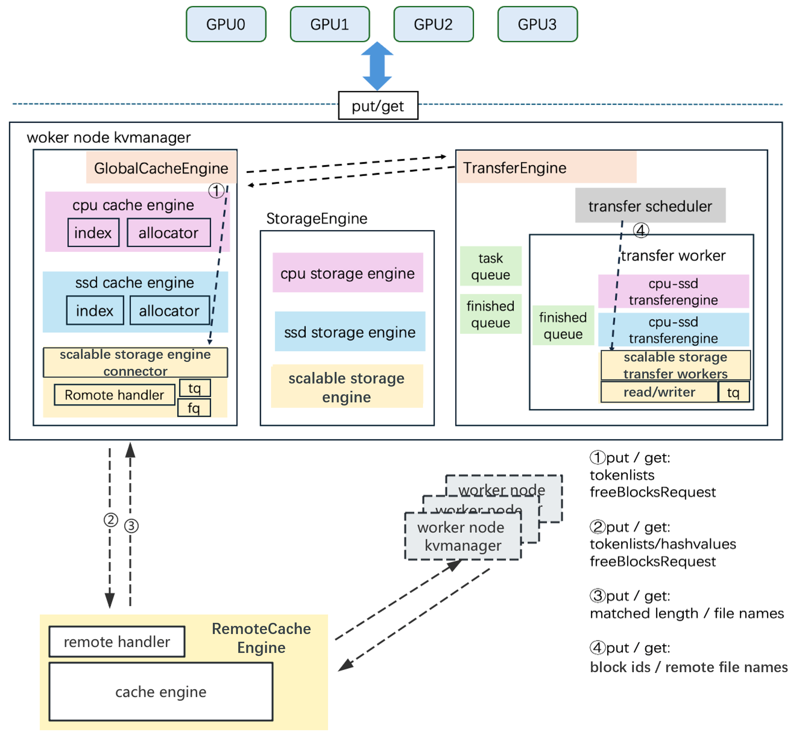

# FlexKV: A KVCache Manager for High-Performance Distributed Inference

**中文文档**: [README_zh.md](README_zh.md)

FlexKV is a distributed KV store and multi-level cache management system developed by Tencent Cloud's TACO team in collaboration with the community, designed for large-scale LLM inference scenarios. FlexKV leverages multi-level caching to enable inference engines to achieve higher throughput and lower latency.

FlexKV is released under the **Apache-2.0 License**. See the [LICENSE](LICENSE) file for details.


## Main Change for latest version
### Feature
Universal:
- Add op-level callback for local get/put [#13](https://github.com/taco-project/FlexKV/pull/13)
- Add support for distributed sharing of the KV Cache, to suppot KV Cache sharing between CPU and SSD, as well as distributed sharing of PCFS  ([#17](https://github.com/taco-project/FlexKV/pull/17))
- Add GDS (GPU Direct Storage) Support ([#25](https://github.com/taco-project/FlexKV/pull/25))
- TP16 support ([#26](https://github.com/taco-project/FlexKV/pull/26))
- Support more kv cache layout. Now include: vLLM, SGLang, TensorRT-LM ([#27](https://github.com/taco-project/FlexKV/pull/27))
- GDS refactor & gtensor support ([#42](https://github.com/taco-project/FlexKV/pull/42))
- Support construct TensorSharedHandle directly from CUDA IPC Handle ([#44](https://github.com/taco-project/FlexKV/pull/44))


Targeting vLLM: 
- Support dp > 1 while integrated with vLLM ([#18](https://github.com/taco-project/FlexKV/pull/18))
- Add launch scripts for vLLM adaption ([#47](https://github.com/taco-project/FlexKV/pull/47))
- Support TP16 for vLLM+FlexKV ([#59](https://github.com/taco-project/FlexKV/pull/59))

Targeting TensorRT-LLM 
- Support using FlexKV on TensorRT-LLM ([#48](https://github.com/taco-project/FlexKV/pull/48))
- Support TP16 for TensorRT-LLM+FlexKV ([#53](https://github.com/taco-project/FlexKV/pull/53))

### Optimization
- Mla d2h transfer optimization ([#19](https://github.com/taco-project/FlexKV/pull/19))
- optimize SSD I/O ([#33](https://github.com/taco-project/FlexKV/pull/33))
- Enhance cache eviction with frequency-aware grace time mechanism ([#38](https://github.com/taco-project/FlexKV/pull/38))
- Replace std::map with std::unordered_map in RadixTree ([#41](https://github.com/taco-project/FlexKV/pull/41))

For more details, see [CHANGELOG](CHANGELOG.md)

## How to Use

### Install Dependencies

```bash
apt install liburing-dev
apt install libxxhash-dev
```

### Build FlexKV

```bash
./build.sh
#./build.sh --release for cython package
```

### Use FlexKV with vLLM

See [docs/vllm_adapter/README_en.md](docs/vllm_adapter/README_en.md)

### Use FlexKV with TensorRT-LLM

See [docs/trtllm_adaption/README_en.md](docs/trtllm_adaption/README_en.md)

### FlexKV Integration with Dynamo

See [docs/dynamo_integration/README_en.md](docs/dynamo_integration/README_en.md)

## Design Architecture

<div align="center">
  
</div>

FlexKV consists of three core modules:  
- **StorageEngine**  
- **GlobalCacheEngine**  
- **TransferEngine**

### StorageEngine

The StorageEngine initializes the three-level cache based on configuration. It groups multiple tokens from a request into a block and stores the KVCache at the block level, maintaining the same KV shape as in GPU memory. The actual storage offset is calculated via block ID.

Additionally, users can enable *block-wise mode*, where caches across multiple layers and KV components are merged into larger blocks. This increases I/O size and enables faster data transfer.

### GlobalCacheEngine

The GlobalCacheEngine acts as the control plane of FlexKV. It determines the direction of data transfer and identifies source and destination block IDs.

GlobalCacheEngine includes:
- A **RadixTree** for prefix matching (match/insert operations)
- A **memory pool (mempool)** to track space usage and trigger eviction

When a new request arrives, the GlobalCacheEngine compares the number of matched tokens across the three storage levels and decides to fetch the corresponding blocks from SSD or scalable storage, transferring them through CPU memory to GPU.

### TransferEngine

The TransferEngine serves as the data plane of FlexKV, executing data transfers based on decisions from the GlobalCacheEngine.

Key features:
- Each process uses multi-threading for parallel transfers.
- Supports high-performance I/O mechanisms such as io_uring to accelerate data transfer.

### Three-Tiered Caching

FlexKV uses cost-effective storage to mitigate GPU VRAM shortage, which otherwise forces KVCache to be discarded and recomputed.

The three-level cache hierarchy:
- **CPU memory** – First-level external cache
- **Local SSD** – Second-level persistent cache
- **Scalable storage(e.g., cloud storage)** — Third-level distributed cache, supporting larger capacity and cross-node sharing

FlexKV performs:
- Search and match across all three levels during *get* operations.
- Perform **logical LRU eviction** without triggering physical data movement when space is insufficient.

#### Asynchronous API Design:
- *get* requests can be called asynchronously; the time for matching and data transfer can overlap with prior computation through prefetching.
- *put* requests can be called asynchronously; the time to copy data from GPU to CPU memory can overlap with subsequent computation. Data transfers between CPU memory, SSD, and scalable storage are fully handled asynchronously by the TransferEngine and transparent to the main process.

## Branch
- The main branch is the stable branch, which maintains already tested commits. Please pull from main branch if you need stable code.
- The dev branch is the development branch, which contains newer features. Please branch from and merge into dev if you need new features or are developing new functionality.
- The bugfix branch is for bug fixes, maintaining urgent bugs that need immediate resolution or documentation that requires prompt updates. If you need to fix a bug or update documentation urgently, please branch from and merge into the bugfix branch.
- The stable branch refers to the previous main branch state, intended only for rollback or extremely conservative use cases (e.g., production deployment). Its use is discouraged.

## Roadmap

- **In-Process Cache Engine Integration**: In the dev branch, the implementation, integration, and invocation of the Cache Engine will be further optimized, along with synchronized updates to related APIs.
- **Framework Integration**: Support works for vLLM, SGLang, and other acceleration frameworks will be updated soon.
- **Distributed Query Support**: Enable scalable, distributed KVCache lookup.
- **Latency Optimization**: Further reduce *get* latency via smarter prefetching and compression.
