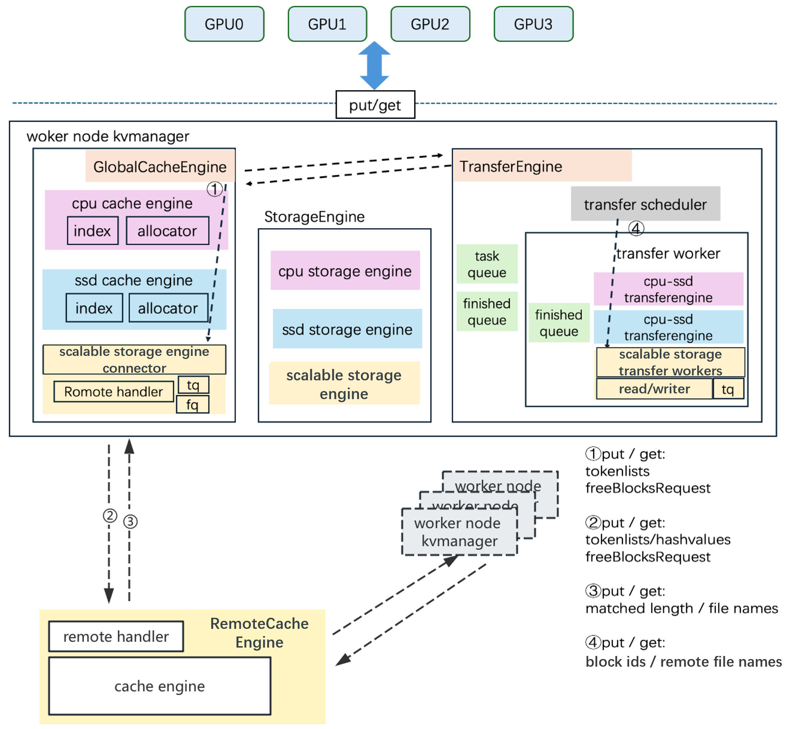

# FlexKV: A KVCache Manager for High-Performance Distributed Inference

**中文文档**: [README_zh.md](README_zh.md)

FlexKV is a distributed KV store and multi-level cache management system developed by Tencent Cloud's TACO team in collaboration with the community, designed for large-scale LLM inference scenarios. FlexKV leverages multi-level caching to enable inference engines to achieve higher throughput and lower latency.

FlexKV is released under the **Apache-2.0 License**. See the [LICENSE](LICENSE) file for details.

## Updates

- **Jul–Aug 2026**: Transfer performance and operability received a broad refresh: [adaptive multi-path GPU↔CPU transfers](https://github.com/taco-project/FlexKV/pull/203), [reliability and operational logging](https://github.com/taco-project/FlexKV/pull/233), [graceful shutdown](https://github.com/taco-project/FlexKV/pull/238), [chunked host-memory registration](https://github.com/taco-project/FlexKV/pull/240), [vectored SSD I/O](https://github.com/taco-project/FlexKV/pull/242), and [per-operation transfer tracing](https://github.com/taco-project/FlexKV/pull/247).

- **Jul 24, 2026**: [Mooncake Store](https://github.com/kvcache-ai/Mooncake) can now serve as FlexKV's key-addressed remote cache tier ([#231](https://github.com/taco-project/FlexKV/pull/231)), enabling cluster-wide KV reuse with zero-copy RDMA and support for DeepSeek-V4 SWA/state sidecars.

- **Jul 21, 2026**: DeepSeek-V4 support landed in FlexKV ([#225](https://github.com/taco-project/FlexKV/pull/225)), covering heterogeneous C4/C128/indexer KV groups, FullKV + SWA dual caches, attention/indexer compress-state sidecars, and layerwise restore. See the [SGLang integration guide](flexkv/integration/sglang/README.md) and [DeepSeek-V4 design notes](docs/dsv4_compress_state_io_zh.md).

- **Jul 7, 2026**: 🎉 The FlexKV connector was merged into [SGLang](https://github.com/sgl-project/sglang) mainline ([PR #29701](https://github.com/sgl-project/sglang/pull/29701)), providing native CPU/SSD KV-cache offloading through `--enable-flexkv`.

- **Jul 7, 2026**: Added byte-exact NVFP4 KV-cache offload and reload for vLLM on Blackwell GPUs ([#204](https://github.com/taco-project/FlexKV/pull/204)).

- **Jun 24, 2026**: Added [layerwise KV transfer with SGLang/Mooncake integration](https://github.com/taco-project/FlexKV/commit/71dfa69), [Pipeline Parallel support](https://github.com/taco-project/FlexKV/commit/1a91e7f), and [HugePage-backed host cache](docs/hugepage/README_en.md).

- **Jun 8, 2026**: Integrate nvcomp into FlexKV.

- **Mar 17, 2026**: 🎉 FlexKV has been officially merged into [vLLM](https://github.com/vllm-project/vllm) mainline ([PR #34328](https://github.com/vllm-project/vllm/pull/34328))! Starting from **vLLM v0.17.2**, `FlexKVConnectorV1` is built in — no patch required. See [docs/vllm_adapter/README_en.md](docs/vllm_adapter/README_en.md) for updated usage.

- **Mar 3, 2026**: 🎉 FlexKV has been officially merged into [NVIDIA Dynamo](https://github.com/ai-dynamo/dynamo) ([PR #5858](https://github.com/ai-dynamo/dynamo/pull/5858))! FlexKV is now a native KV Cache Offloading option in Dynamo, enabling KV-aware routing + multi-level cache offloading in a unified pipeline. See [docs/dynamo_integration/README_en.md](docs/dynamo_integration/README_en.md).

- **Jan 28, 2026**: [Mooncake Transfer Engine](https://github.com/kvcache-ai/Mooncake) integration is now available — FlexKV supports [distributed KVCache reuse](docs/dist_reuse/README_en.md) with high-performance RDMA-based cross-node transfer.

- **Jan 2026**: TensorRT-LLM support added ([#48](https://github.com/taco-project/FlexKV/pull/48)), enabling FlexKV multi-level caching in TRT-LLM inference pipelines. TP16 support for both vLLM and TRT-LLM ([#53](https://github.com/taco-project/FlexKV/pull/53), [#59](https://github.com/taco-project/FlexKV/pull/59)).

- **Dec 2025**: GPU Direct Storage (GDS) support added ([#25](https://github.com/taco-project/FlexKV/pull/25)), enabling direct SSD-to-GPU transfers without CPU involvement.

- **Nov 2025**: FlexKV transitioned from client-server mode to a **directly-callable library** (commit [0290841](https://github.com/taco-project/FlexKV/commit/0290841dce65ae9b036a23d733cf94e47e814934)), eliminating inter-process communication overhead. This is the v1.0.0 API.

## Main Change for latest version
### Feature
Universal:
- Add op-level callback for local get/put [#13](https://github.com/taco-project/FlexKV/pull/13)
- Add support for distributed sharing of the KV Cache, to suppot KV Cache sharing between CPU and SSD, as well as distributed sharing of PCFS  ([#17](https://github.com/taco-project/FlexKV/pull/17))
- Add GDS (GPU Direct Storage) Support ([#25](https://github.com/taco-project/FlexKV/pull/25))
- TP16 support ([#26](https://github.com/taco-project/FlexKV/pull/26))
- Support more kv cache layout. Now include: vLLM, SGLang, TensorRT-LM ([#27](https://github.com/taco-project/FlexKV/pull/27))
- GDS refactor & gtensor support ([#42](https://github.com/taco-project/FlexKV/pull/42))
- Support construct TensorSharedHandle directly from CUDA IPC Handle ([#44](https://github.com/taco-project/FlexKV/pull/44))


Targeting vLLM:
- Support dp > 1 while integrated with vLLM ([#18](https://github.com/taco-project/FlexKV/pull/18))
- Add launch scripts for vLLM adaption ([#47](https://github.com/taco-project/FlexKV/pull/47))
- Support TP16 for vLLM+FlexKV ([#59](https://github.com/taco-project/FlexKV/pull/59))

Targeting SGLang:
- The native FlexKV backend is available in upstream SGLang `v0.5.16` and later; no patch is required ([sglang#29701](https://github.com/sgl-project/sglang/pull/29701))
- Support DeepSeek-V4 heterogeneous C4/C128/indexer KV groups, FullKV + SWA dual caches, compress-state sidecars, and layerwise restore ([#225](https://github.com/taco-project/FlexKV/pull/225)). Until the matching SGLang adaptation is merged, use [sglang#31781](https://github.com/sgl-project/sglang/pull/31781) pinned to [`ee0465a`](https://github.com/sgl-project/sglang/commit/ee0465a09196421a6e4d53a3103eccdef1dd32ac). See the [SGLang integration guide](flexkv/integration/sglang/README.md)

Targeting TensorRT-LLM
- Support using FlexKV on TensorRT-LLM ([#48](https://github.com/taco-project/FlexKV/pull/48))
- Support TP16 for TensorRT-LLM+FlexKV ([#53](https://github.com/taco-project/FlexKV/pull/53))

### Optimization
- Mla d2h transfer optimization ([#19](https://github.com/taco-project/FlexKV/pull/19))
- optimize SSD I/O ([#33](https://github.com/taco-project/FlexKV/pull/33))
- Enhance cache eviction with frequency-aware grace time mechanism ([#38](https://github.com/taco-project/FlexKV/pull/38))
- Replace std::map with std::unordered_map in RadixTree ([#41](https://github.com/taco-project/FlexKV/pull/41))

For more details, see [CHANGELOG](CHANGELOG.md)

## How to Use

### Install Dependencies

```bash
apt install liburing-dev
apt install libxxhash-dev
apt install libhiredis-dev
```

### Build FlexKV

```bash
./build.sh
#./build.sh --release for cython package
```

### Use FlexKV with vLLM

See [docs/vllm_adapter/README_en.md](docs/vllm_adapter/README_en.md)

### Use FlexKV with TensorRT-LLM

See [docs/trtllm_adaption/README_en.md](docs/trtllm_adaption/README_en.md)

### FlexKV Integration with Dynamo

See [docs/dynamo_integration/README_en.md](docs/dynamo_integration/README_en.md)

## Design Architecture

<div align="center">
  
</div>

FlexKV consists of three core modules:  
- **StorageEngine**  
- **GlobalCacheEngine**  
- **TransferEngine**

### StorageEngine

The StorageEngine initializes the three-level cache based on configuration. It groups multiple tokens from a request into a block and stores the KVCache at the block level, maintaining the same KV shape as in GPU memory. The actual storage offset is calculated via block ID.

Additionally, users can enable *block-wise mode*, where caches across multiple layers and KV components are merged into larger blocks. This increases I/O size and enables faster data transfer.

### GlobalCacheEngine

The GlobalCacheEngine acts as the control plane of FlexKV. It determines the direction of data transfer and identifies source and destination block IDs.

GlobalCacheEngine includes:
- A **RadixTree** for prefix matching (match/insert operations)
- A **memory pool (mempool)** to track space usage and trigger eviction

When a new request arrives, the GlobalCacheEngine compares the number of matched tokens across the three storage levels and decides to fetch the corresponding blocks from SSD or scalable storage, transferring them through CPU memory to GPU.

### TransferEngine

The TransferEngine serves as the data plane of FlexKV, executing data transfers based on decisions from the GlobalCacheEngine.

Key features:
- Each process uses multi-threading for parallel transfers.
- Supports high-performance I/O mechanisms such as io_uring to accelerate data transfer.

### Three-Tiered Caching

FlexKV uses cost-effective storage to mitigate GPU VRAM shortage, which otherwise forces KVCache to be discarded and recomputed.

The three-level cache hierarchy:
- **CPU memory** – First-level external cache
- **Local SSD** – Second-level persistent cache
- **Scalable storage(e.g., cloud storage)** — Third-level distributed cache, supporting larger capacity and cross-node sharing

FlexKV performs:
- Search and match across all three levels during *get* operations.
- Perform **logical LRU eviction** without triggering physical data movement when space is insufficient.

#### Asynchronous API Design:
- *get* requests can be called asynchronously; the time for matching and data transfer can overlap with prior computation through prefetching.
- *put* requests can be called asynchronously; the time to copy data from GPU to CPU memory can overlap with subsequent computation. Data transfers between CPU memory, SSD, and scalable storage are fully handled asynchronously by the TransferEngine and transparent to the main process.

### Distributed KVCache Reuse

FlexKV supports distributed KVCache reuse to enable efficient sharing of KVCache across multiple nodes.

Key features include:
- **Distributed RadixTree**: Each node maintains a local snapshot of the global index to avoid centralized bottlenecks and network round-trips during query.
- **Lease Mechanism**: Ensures data validity during cross-node data transfer.
- **Upload & Rebuild**: Local indexes are periodically uploaded to a Global Meta Store (GMS, typically a Redis service), and distributed indexes are rebuilt by pulling metadata from other nodes.
- **Mooncake Transfer Engine**: We use [Mooncake Transfer Engine](https://github.com/kvcache-ai/Mooncake), an RDMA-based transfer engine, to achieve high-performance KVCache transfer between nodes.

## Prometheus Monitoring

FlexKV natively integrates a Prometheus-based runtime monitoring framework that covers key paths in both the Python and C++ layers. It is designed to be **zero-intrusion** — simply set the environment variable `FLEXKV_ENABLE_METRICS=1` to automatically collect core metrics such as cache hit/miss, memory pool status, and data transfer statistics, which are then exposed via standard HTTP endpoints for Prometheus scraping and Grafana visualization.

For the full list of supported metrics, environment variable configuration, deployment guide for the monitoring stack (Prometheus + Grafana), see [docs/monitoring/README_en.md](docs/monitoring/README_en.md).

## Continuous Integration

Pull requests and protected-branch pushes build the release wheel and run the
CPU unit-test tier on GitHub Actions. See the
[CI guide](docs/ci/README_en.md) for the runner configuration, test scope,
reference duration, local reproduction steps, and artifact-upload policy.

## Branching Strategy

The branch management strategy of this project is as follows:

- **`main` branch**: The main development branch that contains the latest features and changes. All pull requests are merged directly into `main` to ensure rapid iteration and continuous integration.

- **`release-*` branches**: When `main` reaches a stable state, we create dedicated release branches (e.g., `release-1.0`, `release-1.1`) to provide stable, production-ready versions for users.

Note: Critical fixes discovered in released versions are applied directly to the corresponding `release-*` branch and then backported to `main` to maintain consistency across all active branches.

## Roadmap

- **In-Process Cache Engine Integration**: In the dev branch, the implementation, integration, and invocation of the Cache Engine will be further optimized, along with synchronized updates to related APIs.
- **Framework Integration**: Deepen the native vLLM, SGLang, and TensorRT-LLM integrations and expand support to more inference engines.
- **Distributed Query Support**: Enable scalable, distributed KVCache lookup.
- **Latency Optimization**: Further reduce *get* latency via smarter prefetching and compression.
