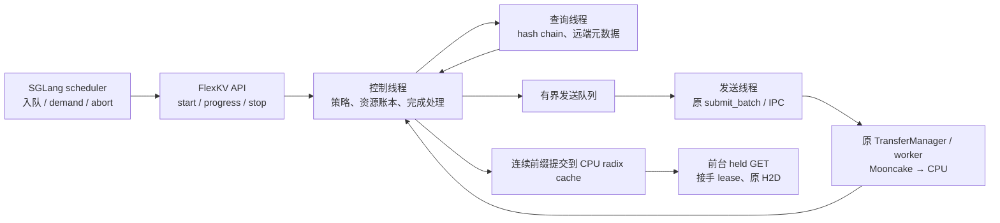
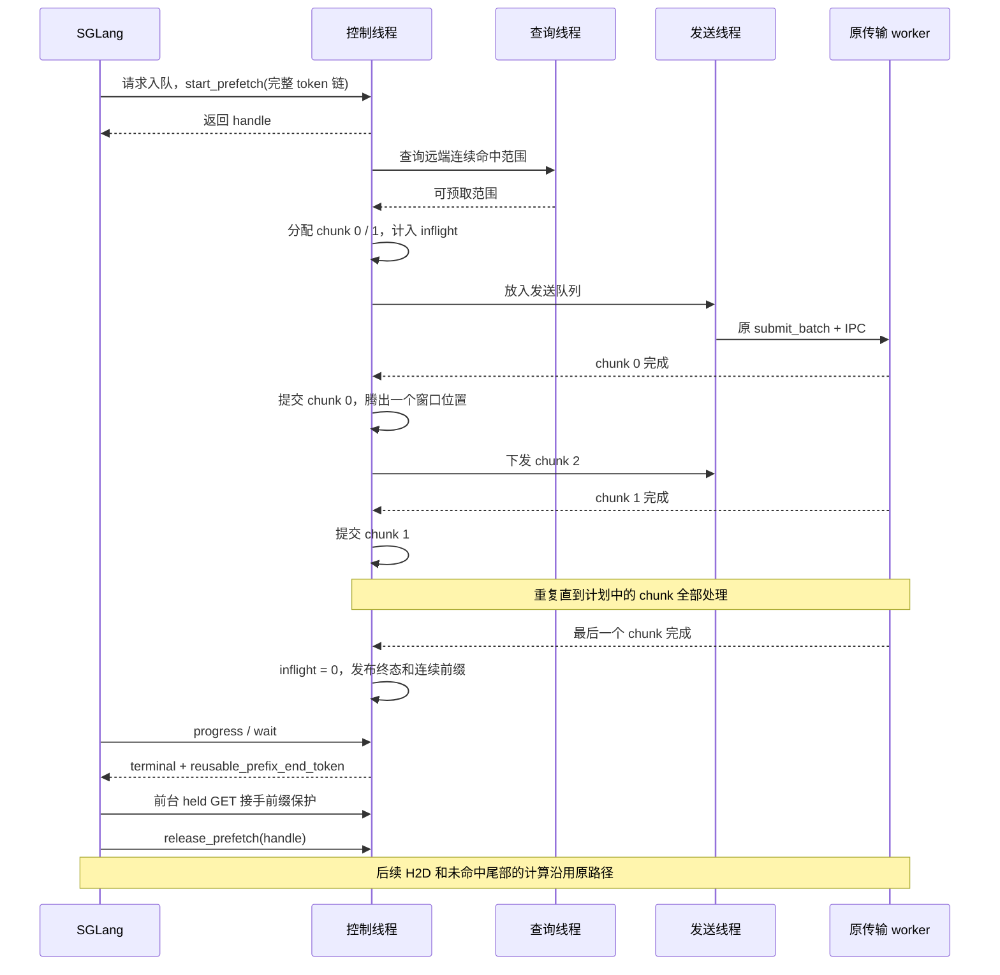
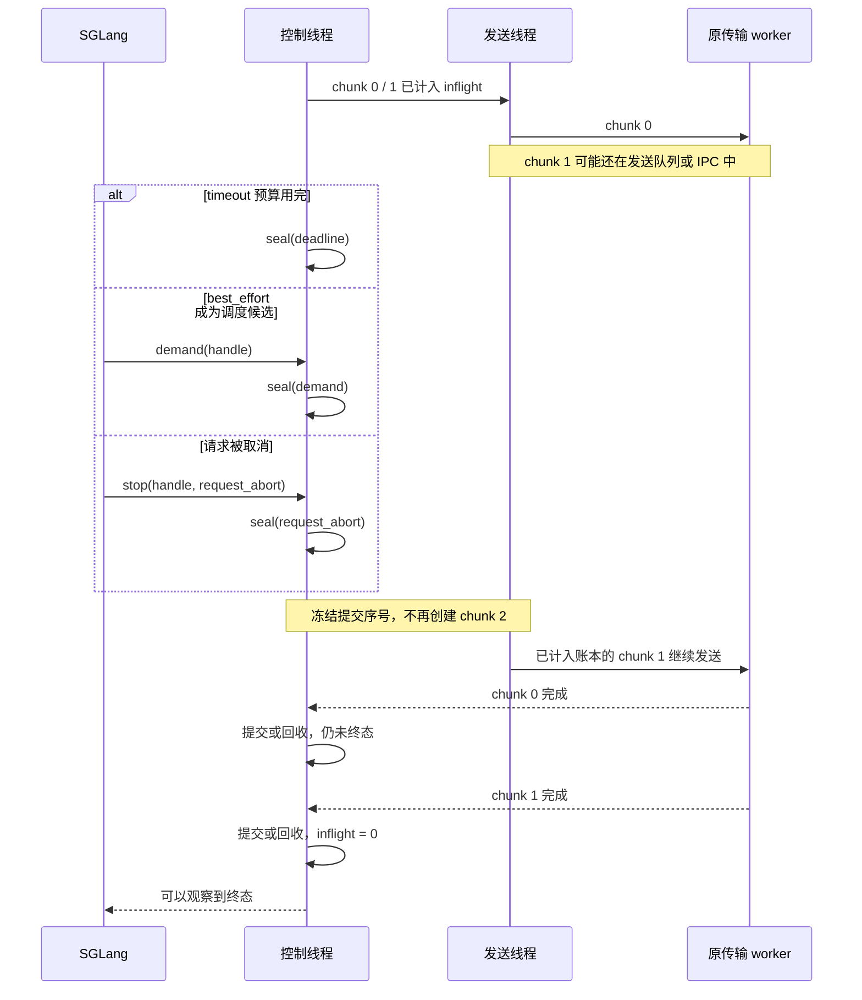
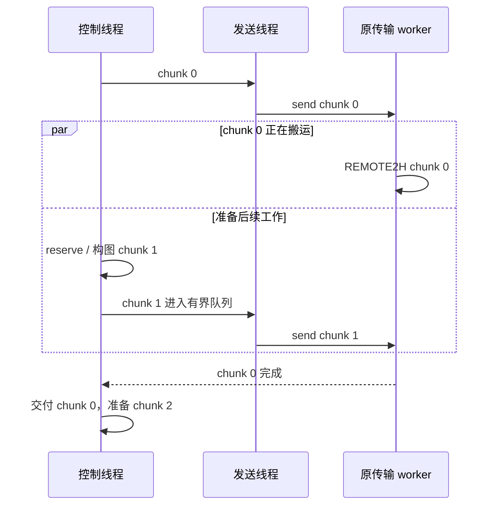
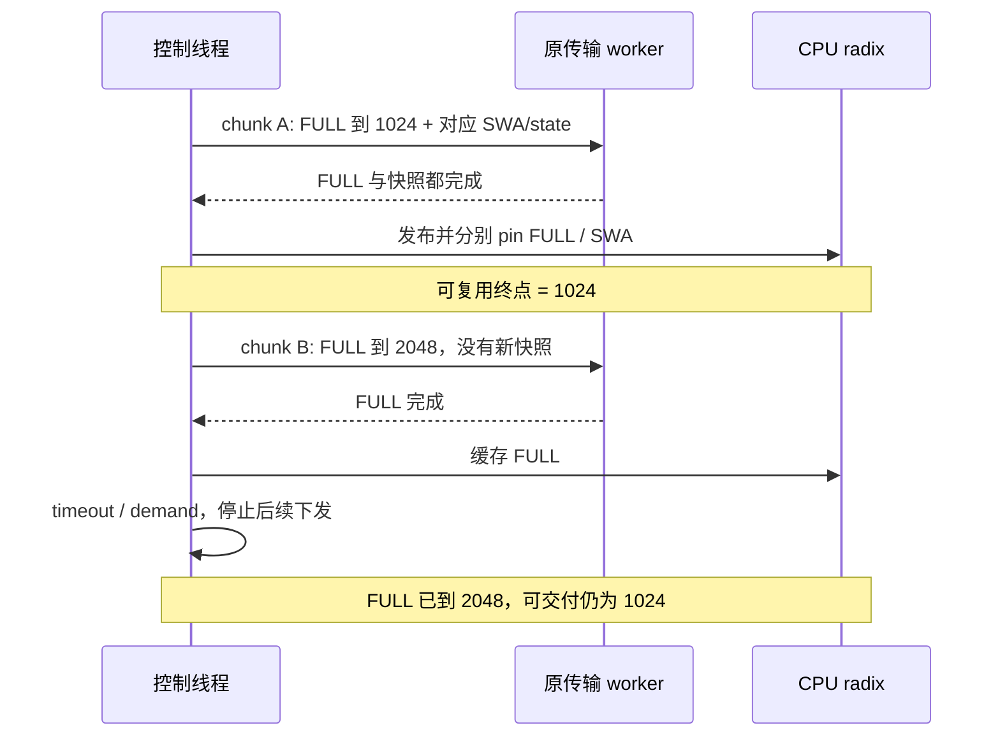

# FlexKV 分段预取：实现说明

**把一次大预取拆成小图，由后台线程逐段下发。需要停止时，停止增加新图；已经下发的图执行完，再返回可用前缀。**

传输仍走原来的 `REMOTE2H → CPU cache → H2D`。新增代码负责何时下发、何时停止、何时可以交付结果，原有 worker、kernel 和图协议保持原样。

本文先说明行为和时序；完整接口、配置与异常约定见 [开发参考](chunked_prefetch_reference.md)。

## 1. 三种策略只决定一件事：何时停止增加新工作

| 策略 | 何时停止下发 | 适用意图 |
|---|---|---|
| `wait_complete` | 已下发全部计划；错误或容量不足也会停止 | 尽量取完远端命中前缀 |
| `timeout` | 从创建会话起算的时间预算用完 | 给预取有限的时间窗口 |
| `best_effort` | scheduler 开始考虑接纳这个请求，发出 `demand` | 利用请求排队的时间提前加载 |

三者都需要等已下发工作完成后交付结果。`wait_complete` 遇到容量不足或远端读取失败，也可能返回部分前缀。

**timeout 限制的是“继续下发的时间”，不是整个等待时长。** 例如预算 20 ms，用完时仍有两个 chunk 在执行，必须等这两个 chunk 完成。没有强杀传输或提前复用它们的 CPU 缓冲区。

如果预算到期前已下发全部 chunk，终止原因可以是 `complete`，即使 drain 结束时已经超过预算。判断是否超额下发，应检查 seal 时的提交序号，而不是仅看总耗时。

`best_effort` 也不承诺立即返回：请求刚入队就成为调度候选时，可能加载 0 tokens；排队较久时，可能已加载完。普通 `poll` / `wait` 只观察状态，不会代替 scheduler 发送 `demand`。

## 2. 几个名词

| 名词 | 具体含义 |
|---|---|
| session | 一次请求的预取会话，记录策略、进度和资源 |
| chunk | 一段连续 token 对应的 KV；每段生成一张现有 `REMOTE2H` 图 |
| window | 每个 session 最多允许多少个未交付/未回收的 chunk，默认 2 |
| inflight | 已计入下发账本、尚未交付或回收的工作；包含本地发送队列和 IPC 中的图 |
| seal | 关闭这个 session 的后续下发，冻结提交序号 |
| drain | 收齐已下发图的完成消息，提交可用前缀并回收其余部分 |
| lease | 暂时保护返回的 CPU 前缀，避免前台 GET 接手前被淘汰 |

这里的 dense 指**可按连续 token 前缀独立恢复的 KV 路径**，不等于“只支持非 MoE 模型”。有 SWA/压缩状态的模型需要检查完整 checkpoint 语义，不能仅凭模型名称判断支持。

## 3. 谁负责什么



- **控制线程**是 task/session 状态的唯一修改者。前台 GET/PUT 的状态操作也交给它，避免多个线程争抢完成消息。
- **查询线程**计算一次完整 hash chain，并分批查询 metadata；查询过程不持 radix 锁。
- **发送线程**专门执行可能阻塞的 IPC send。即使 send 尚未返回，控制线程也能处理 deadline、demand 和完成消息。

有活动预取或正在运行的传输图时，控制线程通过 2 ms 轮询接收原有完成消息；可继续补窗口时立即推进。空闲时等待新命令或结果 TTL 到期，不持续轮询，避免影响同进程内的 GPU 热缓存推理。新命令会立即唤醒它。它不是实时调度器：正在执行的同步前台操作或 SDK 调用不会被强行抢占。

## 4. 正常完成：窗口为 2



图中返回的 handle 只是查询凭据，**不表示 KV 已加载完成**。真正可用的范围来自终态 snapshot。

## 5. 超时或中断：先封闭，再排空



发送队列中的图也必须 drain，否则可能在调用方释放缓冲区后才开始传输。显式取消请求后，已经成功加载的前缀可以留在缓存；reset/shutdown 会丢弃尚未发布的结果。

## 6. 为什么只交付连续前缀

假设一个请求的远端命中范围被拆成三个 chunk：

| chunk | token 范围 | 结果 |
|---|---|---|
| 0 | `[0, 128)` | 成功 |
| 1 | `[128, 256)` | 到 token 192 后发生缺块 |
| 2 | `[256, 384)` | 成功，甚至可能先完成 |

最终只能交付 `[0, 192)`。chunk 2 无法补上中间的缺口，完成后回收。chunk 1 的未成功部分也回收。乱序完成的 chunk 在前面的结果确定前仍占用资源额度，防止后台不断积压。

SGLang 根据这个前缀执行原 H2D，计算剩余 token。统计中的 `l3_loaded_spans` 仅包含实际提交的数据；metadata 查询到的命中量不作为实际加载量。

## 7. IPC 开销如何被覆盖

借鉴 TBO 的是“当前段传输时准备和下发下一段”的流水线思路：



多个 session 的图还可以合并为一次 `submit_batch`。这能减少控制线程被 IPC 阻塞的机会，但**没有消除 IPC 成本，也不保证传输一定与模型 forward 重叠**。

chunk 越小，停止后的尾部工作通常越少，但 IPC 次数更多；window 越大，流水线更充分，但 drain 尾部和内存占用也可能更大。默认值只是起点，需要用实际模型的 TTFT、吞吐和物理传输日志评估。

## 8. V4 Flash：搬完 FULL KV 还不够

V4 Flash 还需要对应前缀的 SWA 和压缩状态。假设远端 FULL KV 到 token 4096，但完整快照只在 1024、3072：

- 查询同时检查 FULL key 与 SWA/state key，计划终点最多到 3072。
- chunk 可以结束在两个快照之间，完成的 FULL KV 仍可进入 CPU cache。
- **交付给模型的终点只推进到 FULL 和快照都已成功发布的边界。** FULL 搬到 2048、快照只到 1024 时，只返回 1024。



SWA 使用原图里的 peer op，与 FULL 共用已有完成协议。FULL 暂存、SWA slot、压缩状态都计入字节预算；FULL 与 SWA 分别锁定，防止独立 SWA LRU 淘汰仍被结果引用的快照。任一传输失败都不能制造一个虚假的可用 checkpoint。

SGLang Hybrid Radix 继续管理 GPU 树。H2D 恢复到请求持有的槽位，完成 prefill 后再由原缓存插入逻辑接管；所有会拒绝请求的准入检查在 H2D 下发之前执行。后台预取只到 CPU，前台 H2D 仍沿用原路径。

准入暂时返回 `NO_TOKEN` 时，如果当前没有可运行请求，不能把 batch 永久标记为已满；下一轮必须重试。否则后台已经 drain、GPU 也空闲，等待队列仍可能无法推进。FlexKV 采用 HiCache 已有的空 batch 重试规则。

## 9. 最小配置与调用顺序

在已有 FlexKV 配置中增加：

```json
{
  "enable_chunked_prefetch": true,
  "prefetch_options": {
    "policy": "timeout",
    "timeout_budget_s": 0.02,
    "chunk_max_blocks": 128,
    "max_inflight_chunks": 2
  }
}
```

`0.02` 秒仅为演示值。chunk 仅用 `chunk_max_blocks` 控制大小；单个 block 及绑定的 SWA 快照不能拆分，实际段长仍受剩余前缀、checkpoint 和资源容量约束。全局 `prefetch_max_reserved_bytes` 和 `prefetch_max_pinned_bytes` 是资源硬上限。保留已有 CPU/Mooncake 配置，SSD 容量设为 0。新模式默认关闭，需搭配本分支提供的 SGLang 补丁。

调用顺序是：`start → progress/demand/stop → terminal → held GET → release`。完整 token 链必须从头传入，不能只传待加载后缀；`candidate_start_token` 仅用于计算 timeout 的候选长度。

`wait_prefetch(timeout_s=...)` 是调用方的等待上限，和策略预算不同。等待超时不会自动取消 session；终态之前不能依据一次 wait 返回就释放 inflight 资源。

## 10. 如何检查是否正确

| 检查点 | 证据 |
|---|---|
| 停止后不再下发 | 终态 `submitted_chunks == sealed_submit_seq` |
| 没有提前交付 | `terminal` 时 `inflight_chunks == 0` 且 `inflight_bytes == 0` |
| 返回数据可用 | `lease_valid`，并由前台 held GET 接手保护 |
| 仅统计真实远端加载 | `l3_loaded_spans` + REMOTE2H/H2D 日志 |
| 没有资源泄漏 | 测试释放后 pin/reserved 归零、allocator 回到基线 |
| 部分恢复后计算正确 | GPU KV 逐元素校验；模型输出与冷计算参考比较 |

截至 2026-09-07：445 项 FlexKV 回归通过、9 项因 Python radix 无 SWA 支持跳过；29 项 SGLang 接口/准入测试、25 项真实 GPU/Mooncake 回归，以及 1 项 FULL + SWA 字节回归通过。

GLM-5.2-FP8、DeepSeek-V4-Flash-FP8 在 H20 TP8 上各完成三策略的 C1 六条、C8/C32 各 32 条，共 420 条正式请求；2K/8K/16K 输入的完整 64-token 输出与零命中参考一致。timeout 已自然返回部分前缀，V4 结果止于完整 SWA/state checkpoint；best_effort 覆盖立即 demand 与排队 L3 加载。压力使用共享前缀，包含 GPU/CPU 热命中，每档仅一轮，不能作为性能提升或长稳验收。V4 首行编号的早期差异也在原生 GPU 复用中复现；主矩阵固定首行格式后重新建立参考，原始失败另行保留。

**缓存池必须按模型、权重、dtype、TP 和 KV 布局隔离。** 已复现 TP2 读取 TP1 旧池导致输出不一致：既有 key 未包含 TP/layout 指纹。SGLang 前台尚未传递 namespace，所以应使用独立存储池。

当前显式拒绝 SSD、P2P、多节点和 TRT remote。SWA checkpoint 已通过上述 V4 Flash 配置的输出校验与有界压力，不能泛化为所有 SWA 模型均已验收。DP、layerwise、默认 Cython 发布构建尚未完成实机验收。发送状态不确定时会保留缓冲区并报错，不能把它当作可安全重试或已成功完成。
