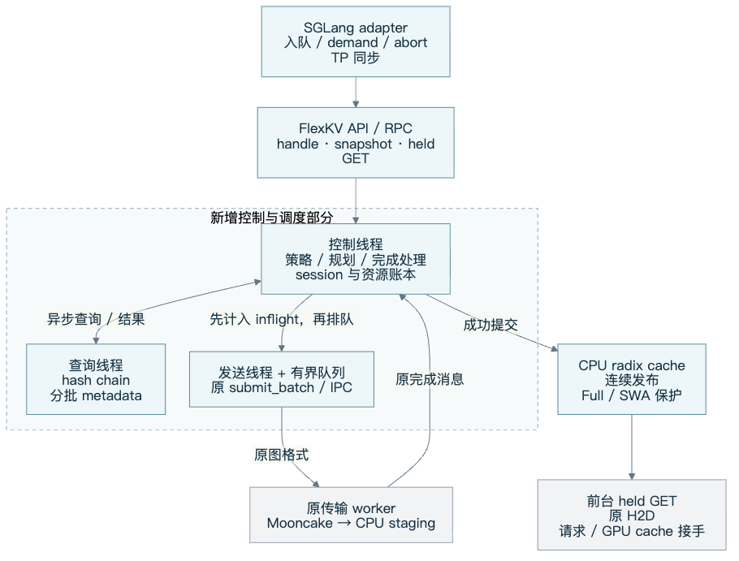
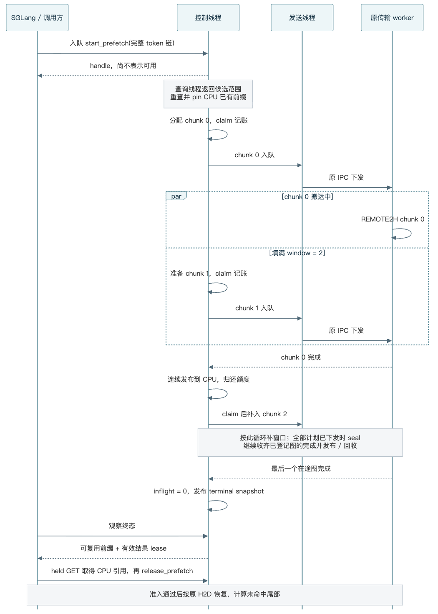
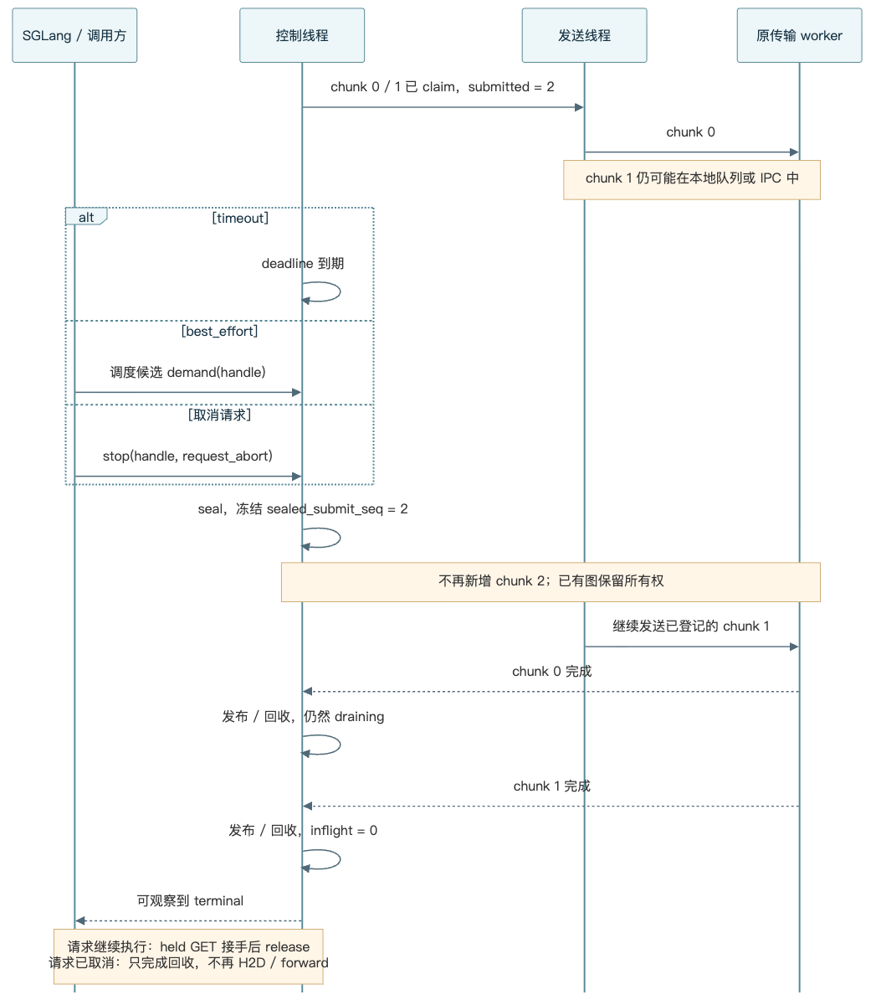

# FlexKV 分段预取策略支持设计

**将一次远端预取拆成若干现有传输图，由独立控制线程按窗口下发。策略决定何时停止新增工作；已计入下发账本的图全部收齐后，交付受保护的连续 CPU 前缀，再由 SGLang 接手 H2D。**

本文按“策略与接口 → 分块与下发 → 停止与交付 → 框架对接”组织，说明实现方式、选择理由和必须遵守的约定。内容对应当前工作区实现，验证状态截至 2026-09-07；配置与监控说明于 2026-09-08 更新；[实现说明](chunked_prefetch.md)和[完整接口参考](chunked_prefetch_reference.md)提供其他阅读入口。

阅读导航：[1. 策略与范围](#s1) · [2. 架构与线程](#s2) · [3. 接口](#s3) · [4. 核心流程](#s4) · [5. SGLang 与 SWA](#s5) · [6. 资源与异常](#s6) · [7. 配置与性能](#s7) · [8. 开发与验收](#s8) · [9. Prometheus 与日志](#s9)

<a id="s1"></a>

## 1. Prefetch 策略和执行机制

原先整段下发后等待完成，无法在请求进入调度或时间预算用完时减少后续预取。新的停止粒度是 **chunk 对应的传输图**：缩小单次下发范围，才能在图之间停止。

**SGLang 服务路由（2026-09-10 更新）：** 启用分段总开关后，`wait_complete` 仍保留原始整任务 `prefetch_async`，在创建 KVManager 前关闭分段运行时；`timeout` 和 `best_effort` 进入分段会话。显式 FlexKV policy 优先，否则使用 SGLang 的策略参数。总开关关闭时始终走原始路径，不启用 timeout 停止。下面的策略表和线程/lease 流程描述显式会话 API；该 API 的 `wait_complete` 兼容能力保留，服务侧的整任务路径不经过它。external server 仍按自身配置启动，客户端不会更改已运行的 server。

| 策略 | 停止新增图的条件 | 调用方可以期待的行为 |
|---|---|---|
| `wait_complete` | 全部计划已下发；容量不足或错误也会停止 | 尽量取完远端连续命中前缀，仍可能得到部分或空结果 |
| `timeout` | 从 session 创建起算的单调时钟预算到期 | 限制继续下发的时间，随后等待已有窗口排空 |
| `best_effort` | scheduler 开始考虑接纳请求，发送 `demand` | 利用排队时间预取；立即被调度时可能加载 0 tokens |

**timeout 不是整个调用的延迟上限，demand 也不是立即返回。** 例如 30 ms 到期时仍有两个 chunk 在途，返回时间还包含它们的 drain。若预算到期前已经下发全部计划，停止原因可以是 `complete`，即使最终完成时间超过预算。

策略通过 `register_prefetch_policy(name, callback)` 在启动时注册，首个 coordinator 启动后冻结。回调契约为 `(event, now, deadline) → stop_reason 或 None`，只判断停止条件；分配、提交、回收均由统一执行器负责。因此新增策略不会复制三套资源管理逻辑。

**本版范围**为单节点 Mooncake → CPU 的后台预取，支持普通连续 KV，以及满足条件的 Full + SWA/state checkpoint。前台 CPU → GPU 沿用现有 H2D。默认关闭，保留旧预取 API；新模式不接入 SSD、P2P、多节点或 TRT remote。SWA 要求 C++ radix、已注册的 SWA 缓冲区及准确的快照字节数。

借鉴 HiCache 的是停止后排空在途工作的语义、调度候选触发 demand，以及空 batch 的准入重试规则；借鉴 TBO 的是分段流水线。传输 worker、kernel、`TransferOp` 格式以及已有图提交/完成协议均不变，也不增加底层传输强制取消协议。

<a id="s2"></a>

## 2. 线程架构



| 部件 | 职责与交接边界 | 为什么这样拆 |
|---|---|---|
| SGLang adapter | 入队启动、调度候选 demand、取消传播、TP 同步、前台 GET 接手 | 策略需要知道请求何时真正成为调度候选 |
| 控制线程 `TaskRuntime` | 唯一维护 task/session 状态、下发账本和完成处理；coordinator 管生命周期，planner 负责构图/提交缓存 | 避免前台等待与后台预取争抢完成消息、重复释放资源 |
| metadata 查询线程 | 独立 query-only Mooncake client；完整 hash chain 计算一次，按最多 256 blocks 查询 | 远端查询不持 radix 锁，也不阻塞控制线程处理停止事件 |
| 每个 transfer handle 的发送线程 | 从有界队列取图，调用原 `submit_batch(List[TransferOpGraph])` | IPC send 阻塞时，控制线程仍能 seal、收完成和处理其他请求 |
| 原传输系统 | 执行 REMOTE2H / H2D，返回原有完成结果 | 保持数据搬运和底层协议稳定 |

启用该模式后，前台 GET/PUT/match/launch/cancel 的状态操作也转交控制线程。外部调用通过命令队列和 Future 等待结果，只有控制线程消费完成通道。查询线程和发送线程不会直接修改 session 或发布 CPU 前缀。

控制循环依次处理有限数量命令、检查发送错误、非阻塞收完成、按顺序提交结果，再公平地为各 session 补窗口。每轮每个 session 最多新增一个 chunk，并轮转遍历顺序，避免一个长请求一次占满全部下发机会。命令立即唤醒；已有完成句柄不能直接用于事件等待，因此有活动预取或 RUNNING 传输图时按 2 ms 轮询，可补窗口时立即继续。没有活动工作时等待命令或最近的结果 TTL，不持续占用 TP0 的 Python 执行时间；尚未下发的 held GET 不触发完成轮询，异步 PUT 的未完成尾部仍触发轮询。

这是独立控制循环，不是实时抢占系统：同步前台状态操作仍在该线程串行执行；metadata 查询只能在批次之间停止，正在执行的 SDK 调用不会被强行打断。

<a id="s3"></a>

## 3. 接口

一次预取对应一个 session。`PrefetchHandle(epoch, session_id)` 标识该会话，`PrefetchOptions` 给出策略、chunk 和窗口参数，`PrefetchSnapshot` 是不可变的状态快照。直接调用与 server/client RPC 使用相同语义。

| 接口 | 调用时机与约定 |
|---|---|
| `prefetch_capabilities()` | 初始化时检查策略、协议版本及 SWA checkpoint 能力；能力不匹配应在启动阶段失败 |
| `start_prefetch(full_token_ids, options, namespace=None)` | 入队启动，返回 handle；不代表数据已经加载或可用于 H2D |
| `progress_prefetch(handles, demand_handles=())` | 批量推进/观察；adapter 在请求成为调度候选时将其放入 `demand_handles` |
| `poll_prefetch(handles)` / `wait_prefetch(handle, timeout_s=...)` | 观察或等待终态；不会发送 demand，wait 的等待超时也不会自动停止 session |
| `notify_prefetch_demand(handles)` | 显式通知调度需求，供独立调用方使用 |
| `stop_prefetch(handle, reason="request_abort")` | seal 后续下发；该调用返回的 snapshot 可能仍是 draining |
| `release_prefetch(handle)` | 释放结果保护，幂等；对活动 session 调用会同时停止新增工作，资源仍等待 drain |

`full_token_ids` 必须包含完整 token 链，不能只传未命中后缀，否则远端链式 hash 会变化。`candidate_start_token` 仅用于计算预算对应的候选长度，不改变 hash 输入。直接 API 支持 namespace；SGLang 当前的 namespace 限制见第 5 节。

| snapshot 字段组 | 需要区分的含义 |
|---|---|
| `state / terminal / outcome / stop_reason / error` | 当前阶段、是否安全结束、结果分类及停止原因；`complete` 停止原因不等于已收到所有完成 |
| `planned_end_token` | metadata 和本地状态确定的计划终点，不是实际加载量 |
| `reusable_prefix_end_token / lease_valid` | 受保护的可复用前缀终点及保护是否仍有效；调用方在终态后按此接手 |
| `l3_loaded_spans` | 实际成功发布且落在可交付范围内的 L3 区间，用于命中统计 |
| `submitted_chunks / sealed_submit_seq / inflight_chunks / inflight_bytes` | 下发账本、seal 时冻结的提交序号、尚未交付或回收的工作量 |

所有位置均为绝对 token offset。RPC 使用每次调用独立的本地控制 socket；旧接口的长时间 wait 采用非阻塞等待登记，不能占住服务端而阻止新的 stop/progress 请求。

<a id="s4"></a>

## 4. 核心流程

### 4.1 规划

1. 查询线程计算完整 hash chain，分批查询远端连续 Full 命中；遇到缺块停止扩大范围。SWA 模式同时收集有效 checkpoint，并将远端计划终点限制到最后一个完整 checkpoint。
2. 查询返回后，控制线程重新匹配 CPU radix，并 pin 已有可用前缀。查询期间其他请求可能已发布数据，重新匹配能避免按过时的 CPU 命中位置重复加载。
3. 仅在窗口有空位时，为下一个连续区间分配独立 CPU staging 并构建一张现有 REMOTE2H 图。图保留原有 block hash、namespace 和 DP 归属，不提前把未完成数据暴露给 radix。
4. chunk 大小同时受 block 数上限、剩余前缀、SWA/checkpoint 以及全局 reserved/pinned 预算约束。构图后、正式记入账本前再次检查 deadline；如果分配期间预算已到期，直接回收尚未下发的 staging。

这里拆的是 task/算子图对应的 token 范围，不修改 worker 内部如何搬运数据。CPU staging 按窗口懒分配，也就不需要为整个远端命中前缀一次性预留内存。

### 4.2 流水下发



**claim 是下发所有权的分界点：先登记 graph → session、预留字节和提交序号，再交给发送队列。** 从这一刻起，图即使还停在本地队列或 IPC 中，也属于 inflight。这里的 inflight 包含“已下发但尚未按序交付/回收”的工作，不只指正在网卡上搬运的字节。

窗口为 2 时，chunk 0 传输期间可以准备并发送 chunk 1；chunk 0 发布后再补 chunk 2。同一轮多个 session 的图可以合并为一个 `submit_batch`，减少逐 session 发送开销。独立发送线程加窗口，提供了准备、IPC 与传输之间的重叠机会；窗口大小仍受全局资源预算限制。

### 4.3 中断：seal 冻结新增工作，drain 收齐已有工作



正常取完、timeout、demand、显式取消和容量停止都进入同一条收尾路径：记录停止原因，冻结 `sealed_submit_seq`，停止新增图，等待账本中的图完成，再提交或回收。API 中主要阶段为 `planning → active → draining → terminal`；如果规划期间就停止，或没有在途图，可以跳过中间阶段。

不能只等待 worker 已经开始执行的图：发送队列里尚未开始的图也持有 CPU 目标地址。若 seal 后提前释放这些地址，稍后的 IPC/worker 执行会写入已复用内存。当前设计因此保留整个已登记窗口，且不承诺强制终止底层传输。

正常运行下，终态必须同时满足：**提交序号停留在 seal 时的值、`inflight_chunks = 0`、`inflight_bytes = 0`、所有可交付结果已完成发布。** 若发送状态不确定，则不能伪造一个已排空的成功终态。

### 4.4 发布：传输完成之后，还要满足连续性

每张图的完成 bitmap 交给原有延迟插入流程处理。coordinator 按 chunk 的前缀顺序提交；后面的图即使先完成，也保留 staging 和窗口额度，直到前面的结果确定。这样既能保证连续前缀，也能限制乱序结果积压。

| chunk | token 范围 | 完成情况 | 最终处理 |
|---|---|---|---|
| 0 | `[0, 128)` | 全部成功 | 发布，连续终点到 128 |
| 1 | `[128, 256)` | 仅 `[128, 192)` 成功 | 发布成功部分，连续终点到 192，并封闭后续扩展 |
| 2 | `[256, 384)` | 全部成功，可以先于 chunk 1 完成 | 无法跨过缺口，完成后回收 |

最终只能交付 `[0, 192)`；不能按成功 block 总数拼出一个不存在的前缀。metadata 命中也不能算作加载成功。SWA 模式还要将这个连续终点限制到已完成的 checkpoint，见下一节。

<a id="s5"></a>

## 5. SGLang 对接

### 5.1 从请求入队到恢复计算

| 阶段 | 对接动作 | 需要保证的事情 |
|---|---|---|
| 请求入队 | adapter 用完整 token 链启动预取，不提前做前台远端 LOOKUP | 不需要另行配置 HiCache backend；FlexKV 配置中的 policy 优先于 SGLang 策略参数 |
| 成为调度候选 | scheduler 检查进度并发送 demand | `best_effort` 在这里停止，不能等实际 forward 才通知；非终态请求继续等待 |
| 预取终态 | 前台 LOOKUP 仅匹配 CPU，取得 held GET 对 CPU 前缀的引用后再 release 预取 lease | 若此时又自动从远端补齐整段，会抵消 timeout/best_effort 的停止效果 |
| 准入与恢复 | 检查 token 预算、prefill chunk 形状和 SWA 容量，通过后才下发 H2D | 准入推迟时释放对应 held task/标记；空 batch 遇 `NO_TOKEN` 必须允许下一轮重试 |
| 继续执行 | 等 H2D 完成，使用已恢复前缀，计算剩余尾部 | CPU-ready 不等于 GPU-ready；L3 统计来自实际发布区间 |
| 请求取消 | 传播 stop，移除请求侧跟踪；coordinator 继续 drain | 取消的请求不会因为后来预取完成而再次触发 H2D 或 forward |

TP 中由 leader 发起和推进预取，其他 ranks 接收相同 handle、终态结果或错误；不能让各 rank 用各自的本地 deadline 独立决定恢复长度。相应 SGLang patch 与 FlexKV 版本配套使用。

### 5.2 两次资源交接不能合并

**CPU 交接：** staging 在完成后进入 CPU radix，并由 session 的结果 lease 保护。前台 held GET 先取得自己的引用，再释放预取 lease；随后由原 GET/H2D 生命周期释放前台引用。先 release 再 GET 会留出可被淘汰的空档。

**GPU 交接：** Hybrid wrapper 中，已完成的 GPU radix 条目及淘汰仍由内部 UnifiedRadixCache 管理。尚未入树的 H2D 目标槽位由请求的 restore lease 持有，通过 generation 与 `pending_restore_slots` 跟踪，避免重复 match 覆盖未提交索引。完成 prefill 后由正常缓存插入逻辑接管；失败路径只释放一次，期间保留正确的 `cache_protected_len`。

### 5.3 DSV4：可用前缀必须包含对应的 SWA/state

Full KV、SWA 和压缩状态共同构成可恢复 checkpoint。V4 的三个主 KV 组与 SWA、两个 C4 state 组需要按实际注册布局计算和传输。本轮 page=256，checkpoint 落在完整的 128-token 压缩段边界，因此不额外保存 C128 的段内 state。模型适配负责这些状态的含义，coordinator 只处理完整 checkpoint 的发布约定。

假设远端 Full 连续命中到 4096，完整 checkpoint 只在 1024 和 3072：规划终点最多是 3072，但中间可以有 Full-only chunk。

| 已完成数据 | CPU cache 可以保留 | 交付给模型的前缀终点 |
|---|---|---:|
| Full 到 1024，1024 快照成功 | Full + 快照 | 1024 |
| Full 继续到 2048，没有新快照 | 中间 Full KV | 仍为 1024 |
| Full 到 3072，3072 快照成功 | Full + 新快照 | 3072 |
| Full 到 3072，但新快照失败 | 已成功的缓存数据 | 最多为此前完整且受保护的 checkpoint |

chunk 结束在 checkpoint 时，向原 Full 图附加现有 SWA peer op，使用原完成协议；任一必要状态失败都不能推进可用终点。Full 和 SWA 有各自的锁与 LRU，因此必须分别 pin。staging、SWA slot 和压缩状态都计入资源预算；`l3_loaded_spans` 也裁剪到可交付 checkpoint。

写回端只存与 page 对齐前缀相对应、已经完成的 SWA/state 快照；不能把尚在演进的中间 prefill chunk 状态当作最终 checkpoint。SGLang 的 SWA 尾部槽位分配、H2D 和正常缓存插入遵循同一份请求 restore lease。

**数据隔离约定：** 同一 Mooncake 池必须使用一致的模型、权重、dtype、TP 和 KV 布局。当前存储 key 不包含完整布局指纹，TP1 写入的数据不能直接交给 TP2 使用。直接 API 可用 namespace；SGLang 前台尚未统一传递 namespace，因此使用独立池，且对 `extra_key/cache_salt` 请求跳过这条可选预取路径。

<a id="s6"></a>

## 6. 资源与异常

| 资源 | 何时持有 | 何时归还 / 约束 |
|---|---|---|
| chunk staging / reserved bytes | 按窗口分配，claim 后直到完成处理 | 按序发布或丢弃后归还；乱序完成不能提前返还额度 |
| CPU 前缀 pin / 结果 lease | 规划复用已有前缀、后续成功发布时 | 前台 GET 接手后 release，或终态 lease 到期；保护 Full 与 SWA |
| 前台 held GET 引用 | 在预取 lease 仍有效时获取 | 由已有前台任务生命周期管理 |
| 请求 GPU restore lease | 准入通过、下发 H2D 前登记 | 正常缓存插入接管，或失败路径释放一次 |
| session / handle | start 创建，epoch 区分运行时 | 活动会话不按 TTL 删除；终态保留后到期，reset 更换 epoch |

全局同时限制 session 数、reserved bytes 和 pinned bytes，单 session 再受 chunk 窗口限制。**预算还预留“全部 staging 将来转成 pinned”的空间**，防止各 chunk 单独看都合规，发布时却一起超出 pin 上限。radix pin 按实际锁住的完整节点及祖先计费；并发插入扩大了节点时，不能只按本请求的逻辑 token 长度低估占用。

| 事件 | 处理方式 | 调用方语义 |
|---|---|---|
| 容量不足、已确认的局部读取失败 | seal，drain，返回此前受保护的连续前缀；容量归类为 `capacity` | 可以得到部分或空结果，再恢复正常计算；即使策略是 wait_complete 也如此 |
| 请求 abort / 活动会话 release | 停止新增，保留账本直到 drain | 成功数据可留在缓存，取消请求不再消费结果 |
| reset | 先 seal；有在途图时返回 draining/retry，排空后才清缓存 | 不能边传输边清空或复用目标地址 |
| shutdown | 停止接收新工作，等待排空，再执行原关闭流程 | 控制侧等待有 30 s guard；失败时保留 worker 仍可能访问的注册缓冲区 |
| IPC 发送异常 / 发布所有权不确定 | 标记 runtime 不健康，保留可能仍被使用的资源，一致传播错误 | 不能盲目重发、释放目标内存，或按“预取没命中”继续掩盖错误 |
| 终态 lease 到期 / 旧 handle | 默认 60 s 后解除保护，有限保留空的 expired 记录；记录淘汰后显式报未知 handle | 旧 snapshot 不再承诺驻留；reset 后不能复用旧 epoch |

可确认未下发的失败可以回收；无法确认是否已被 worker 接收的失败必须保留资源。这是故障处理最关键的分界。发送线程仍使用有界队列，控制命令队列和发送队列当前容量均为 1024，不能依靠无界排队掩盖过载。

<a id="s7"></a>

## 7. 配置

### 7.1 日常调节：block 数、窗口和策略预算

在现有 FlexKV JSON 中增加以下片段，通过 `FLEXKV_CONFIG_PATH` 加载后重启 SGLang。保留 CPU 容量和 Mooncake 连接配置，新模式需将 SSD 容量设为 0；30 ms 只是示例。

```json
{
  "enable_chunked_prefetch": true,
  "prefetch_options": {
    "policy": "timeout",
    "timeout_budget_s": 0.03,
    "chunk_max_blocks": 128,
    "max_inflight_chunks": 2
  }
}
```

| 参数 | 默认值 / 单位 | 调节作用 |
|---|---|---|
| `chunk_max_blocks` | 128，FlexKV blocks | 唯一的 chunk 大小参数，限制一张图的 Full block 数；此前验证中 GLM block=64 tokens，V4=256 tokens |
| `max_inflight_chunks` | 2，每 session | 尚未交付或回收的 chunk 上限；包含发送队列和 IPC 中的图 |
| `timeout_budget_s` | 默认未显式指定，秒 | 显式预算优先；否则使用 `min(30, 2 + 0.1 × candidate_tokens / 1024)` |

**删除 `chunk_target_bytes`。** 原来同时配置 block 数和目标字节数，会让一个参数的修改被另一个参数抵消。统一按 block 控制粒度，planner 仍按真实 KV 布局换算内存占用，并遵守资源硬上限。旧试验 JSON 中的该字段需要删除；这是尚未发布接口的简化，不静默忽略旧字段。

以 B 为每个 Full block 的实际字节数、S 为 SWA/state 快照预留字节（普通路径为 0），规划为：

```text
可用 Full 字节 = min(reserved 剩余额度, pinned 上限 - 已有 pin - 全部 staging) - S
本次 blocks = min(chunk_max_blocks, floor(可用 Full 字节 / B), 剩余前缀 blocks)
再按有效 checkpoint 调整终点；只有落在 checkpoint 才附加快照 op。
```

`chunk_max_blocks` 是上限，并不保证每段都恰好这么大；剩余前缀、资源不足和 checkpoint 都可能缩小 chunk。一个 block 与完整快照不能再拆。不同模型相同 block 数对应不同字节数，升级时应观察实际 chunk 与 drain 尾部，不能把此前双参数下的性能结论直接沿用。FlexKV 的传输 chunk 与 SGLang 的 prefill chunk 是两个独立参数。

调小 chunk 通常减少停止后的尾部工作，却增加构图和 IPC 次数；增大 window 增加重叠机会，也增加在途内存和 drain 尾部。TBO 提供的是重叠机制，是否覆盖 IPC、是否与 forward 重叠，仍需时间线验证。

### 7.2 高级资源限制：保护前台服务，不用于重复控制 chunk

| 配置项 | 默认值 / 作用域 | 保护对象与释放时机 |
|---|---|---|
| `prefetch_max_reserved_bytes` | 512 MiB，每个 FlexKV coordinator | 已分配且尚未交付或回收的 staging；claim 后一直保留到按序 commit/discard |
| `prefetch_max_pinned_bytes` | 2 GiB，每个 FlexKV planner | session 持有的 CPU 前缀锁，以及所有 staging 将来转成 pin 所需的额度；前台 GET 接手后 release，或终态 lease 到期后释放 |
| `prefetch_max_sessions` | 128，同一 coordinator | 活动会话及仍保留结果的会话数；避免小请求或空结果无限积压 |
| `prefetch_result_ttl_s` | 60 秒 | 终态结果保护期限，不用于强制删除活动传输 |

这里的“全局”是单个 FlexKV 实例内所有 session 共享，并不是整台机器、整个集群共享。两个字节上限都计入 Full KV 与 SWA/state；pin 按实际锁住的节点及祖先计费，同一前缀被多个 session 保护时可能保守重复计费，因此数值不是独占物理内存或 RSS。

**保留这两个高级配置，不要求日常同时调节。** 它们源于异步资源生命周期，不是为了复制 HiCache 配置：

- 只有 chunk/window 限制，只能约束一个请求。100 个请求即使每个只保留两个 chunk，仍可能一起占满 CPU cache，挤压前台 GET/PUT。
- 只有 reserved 上限，数据完成后会从 staging 转入 radix，reserved 下降，但结果可能在等待调度或交接期间继续被 pin，不能淘汰；必须另有限额。
- 只有 pinned 上限，可以约束总占用，却不能单独限制高并发的在途暂存和停止后的排空尾部。512 MiB 在途、2 GiB 结果保护分别表达这两项取舍。

额度来自同一 CPU cache 池，不是额外分配的两个内存池。预算检查还保留 `已有 pin + 全部 staging <= pinned 上限`，避免完成时集体超额。实际 allocator 容量也会约束分配；触顶时 seal、drain，交付已保护的连续前缀，余下部分由模型计算。容量回退可能发生在 `wait_complete`，不能把策略名理解为内存充足的保证。

默认值是保守起点，不应盲目随着并发放大。只有观察到 `reason=capacity` 且 CPU cache 仍有余量、前台延迟可接受时，再按限制所在阶段调节；有大量结果等待交接时优先检查调度、release 与 TTL。相关观测见第 9 节。

<a id="s8"></a>


## 8. 开发与验收

### 8.1 实现入口与对接责任

| 模块 | 主要实现入口 | 开发 / 评审重点 |
|---|---|---|
| 协议与策略 | [types.py](../../flexkv/prefetch/types.py)、[policy.py](../../flexkv/prefetch/policy.py) | 句柄、状态快照、配置验证和启动期策略注册 |
| 控制与构图 | [coordinator.py](../../flexkv/prefetch/coordinator.py)、[planner.py](../../flexkv/prefetch/planner.py)、[runtime.py](../../flexkv/prefetch/runtime.py) | claim/seal 顺序、窗口公平性、连续发布、预算、失败所有权 |
| 前台与 RPC | [kvtask.py](../../flexkv/kvtask.py)、[kvmanager.py](../../flexkv/kvmanager.py)、[server](../../flexkv/server) | 完成通道单线程消费、wait 不阻塞控制、句柄和客户端归属 |
| SGLang | [connector.py](../../flexkv/integration/sglang/connector.py)、[配套 patch](../../flexkv/integration/sglang/sglang_chunked_prefetch.patch) | 入队/demand/abort、TP 一致性、CPU-only LOOKUP、准入和两次 lease 交接 |
| 回归与模型验收 | [prefetch tests](../../tests/prefetch)、[实机报告](chunked_prefetch_validation.md) | 部分读取、乱序完成、停止竞态、真实数据一致性及模型 checkpoint |

FlexKV PR 基线为 `016c290`。SGLang 改动通过 [分支间 PR XingLiu1/sglang#6](https://github.com/XingLiu1/sglang/pull/6) 提交，head=`2f91f9f5f0`，base=`agent/flexkv-dsv4-main`；评审后才进入上游 [适配 PR #31781](https://github.com/sgl-project/sglang/pull/31781)。配套 patch 以适配分支 `4b76341435`（源码树与 `16780ea0c8` 一致）为基线，不能直接应用到 main，也不应在评审 PR head 上重复应用。关闭开关是启动时回退方式，运行中已有工作仍必须经过 drain。

### 8.2 已有证据与尚需完成的验证

下表是 2026-09-07 快照的历史验证。2026-09-08 移除字节目标并重放到新主线后，需以 PR 附带的重新验证记录为准；历史模型与 GPU 结果不等同于新主线版本已通过相同验收。

| 层级 | 已完成的验证 | 仍需单独验收 |
|---|---|---|
| 状态机 / 原生集成 | FlexKV 445 项通过，9 项 Python-radix SWA 不支持而跳过；SGLang 对接/准入 29 项通过 | Cython 发布构建及对应运行验证 |
| 真实搬运 | H20 + Mooncake 25/25 预取回归；另有 1/1 Full + SWA 字节一致性往返 | 更多故障持续注入、长期资源趋势 |
| 模型正确性与排队压力 | GLM-5.2-FP8、V4-Flash-FP8 各 210/210；TP8/DP1，三策略，每策略 C1 六条、C8/C32 各 32 条，完整 64-token 输出与各自参考一致 | DP、layerwise 和其他拓扑的独立验收；当前新模式不支持多节点 |
| 性能与长压 | 观察到完整/部分 L3 恢复、立即 demand 的零恢复、排队期间的远端加载 | 同缓存状态三轮性能 A/B、至少逐策略 10 分钟长压及更长稳定性验证、IPC/forward 对齐时间线 |

模型检查为单机、共享前缀、每档一轮的有界负载；C8/C32 包含排队与 CPU/GPU 热命中，不能当作每条请求都是纯 L3 压力，也不能据此宣称性能提升或生产验收完成。GLM 模型轮次早于最终容量分类、日志和类型标注修订，精确源码差异已保留；V4 的早期输出格式差异也保留了关闭 FlexKV 的原生前缀复用对照，正式语料与参考边界见[实机报告](chunked_prefetch_validation.md)。

<a id="s9"></a>

## 9. 监控与日志

### 9.1 当前可采集什么

当前已有通用 FlexKV Prometheus 服务和预取终态日志；**本 PR 尚未实现预取专用 Prometheus 指标**。不能用旧整图 prefetch 或 HiCache 的计数，代替新 chunked session 的成功率、排空时间和 pin 占用。

```bash
export FLEXKV_ENABLE_METRICS=1
export FLEXKV_PY_METRICS_PORT=8080
export FLEXKV_CPP_METRICS_PORT=8081
# SGLang 自身的请求/队列/延迟指标还需启用 --enable-metrics。
```

Python 与 C++ 都在所在进程网络命名空间的 `127.0.0.1:<port>/metrics` 暴露。应由同网络命名空间的 Prometheus agent/sidecar 抓取；远端 Prometheus 不能直接访问这里的 localhost。多个实例应配置不同端口，并在采集侧附加 instance、model、TP/DP 和版本标签。

| 当前信号 | 用途 | 不能据此推出的结论 |
|---|---|---|
| `flexkv_py_mempool_total_blocks` / `flexkv_py_mempool_free_blocks` | CPU 池总量与可分配空间，结合 allocation/eviction 计数检查压力 | 不是新预取 session 的 reserved/pinned 精确占用 |
| `flexkv_py_allocation_failures_total` / `flexkv_py_evicted_blocks_total` | 分配失败与淘汰压力趋势 | 不能覆盖 planner 中每一个容量回退分支 |
| `flexkv_py_transfer_bytes_total` / `flexkv_py_transfer_ops_total` | 原有前台 GET/PUT 完成计数，例如 H2D | 新 chunk 完成由 coordinator 提前分流，当前不完整计入这组通用指标 |
| `flexkv_cpp_cache_ops_total` / `flexkv_cpp_cache_blocks_total` | C++ radix 的操作和 block 统计 | radix 命中、插入不是模型已经使用了 GPU KV |
| SGLang `sglang:num_queue_reqs` / `sglang:num_running_reqs` 及请求延迟 | 发现排队积压、空运行队列、TTFT/吞吐退化 | 缓存收益需同负载、同缓存状态的对照，不能只看总吞吐 |

`poll_prefetch/progress_prefetch` 的 snapshot 已提供每个 session 的 state、inflight_chunks、inflight_bytes、submitted_chunks 和 lease_valid；没有直接暴露全局 pinned gauge。短期排障可采样已知 handle，长期监控应在控制线程汇总，而不是给每个请求建立一条 Prometheus 时间序列。

### 9.2 日志怎么读

`[FlexKV-Prefetch]` 每个 session 终态记录一次：epoch、session_id、policy、reason、submitted_chunks、sealed_submit_seq、loaded_tokens、elapsed_ms、drain_ms、error。该模块使用 Python 标准 logger `flexkv.prefetch.coordinator`，需确保应用日志配置允许 INFO；`FLEXKV_LOG_LEVEL` 控制的是 FlexKV 自身 logger，不能替代此设置。不要在生产长期开启逐 chunk DEBUG 日志。

例如以下为字段含义示例，不是本轮压测结果：

```text
[FlexKV-Prefetch] epoch=example session_id=12 policy=timeout reason=deadline submitted_chunks=2 sealed_submit_seq=2 loaded_tokens=128 elapsed_ms=35.460 drain_ms=5.131 error=None
```

这表示 deadline 后没有新增图，两个已登记 chunk 排空后才返回。`loaded_tokens` 是可交付范围内成功发布的 L3 tokens，不是 metadata 命中量，也不是 H2D 已完成量。`elapsed_ms > timeout_budget` 本身不是违约；需要同时看 seal 后提交序号是否增长、drain 是否异常。

- `reason=capacity` 增多：结合 CPU free blocks、并发与 lease 等待判断是暂存、结果保护还是实际 allocator 压力；目前 reason 没有区分三个容量来源，不能只凭该字段直接调大某个上限。
- `reason=partial_read` 或 `error` 非空：核对 Mooncake 返回、完整 checkpoint 和连续前缀；不要按成功 block 总数推算可用前缀。
- 长时间看不到终态：终态日志无法证明活动任务健康。结合 snapshot 与进程/控制线程错误检查在途账本，不能仅凭日志计数不增长判定无请求。
- 对照 `[FlexKV-IO]` 与 worker 的 REMOTE2H/H2D 记录确认搬运阶段，再看 SGLang 是否真正使用前缀。跨层关联只使用实际出现的 task/graph/session 标识，不假定现有日志已经提供完整关联链。

### 9.3 下一步补齐的专用指标与验收要求

以下是后续实现清单，当前 `/metrics` 中不存在。复用 Python exporter，由控制线程写入；采集线程只读指标值，不遍历或修改 session，也不增加传输面 IPC。

| 拟新增指标 | 类型 / 低基数标签 | 记录边界 |
|---|---|---|
| `flexkv_prefetch_sessions_total` | Counter，policy/reason/outcome | 每个 session 终态只计一次，区分 complete、partial、empty、aborted、failed |
| `flexkv_prefetch_loaded_tokens_total` | Counter，policy | 终态只计可交付 checkpoint 内实际发布的 L3 区间；metadata 命中不计 |
| `flexkv_prefetch_elapsed_seconds` / `flexkv_prefetch_drain_seconds` | Histogram，policy/reason | 分别记录 start→terminal 与 seal→terminal；用 seconds，避免 ms 混用 |
| `flexkv_prefetch_reserved_bytes` / `flexkv_prefetch_pinned_bytes` | Gauge，无请求标签 | 来自 coordinator/planner 账本；包含乱序完成和结果 lease；同时暴露对应 limit |
| `flexkv_prefetch_inflight_chunks` / `flexkv_prefetch_sessions` | Gauge，后者仅 state 标签 | 活动、draining、保留终态结果与在途工作分开看 |
| `flexkv_prefetch_capacity_stops_total` / `flexkv_prefetch_runtime_healthy` | Counter，resource；Gauge | 容量来源限定为 reserved/pinned/allocator，控制或发送异常立即置 unhealthy |

禁止把 request_id、session_id、epoch、token、hash、异常原文作为指标标签；这些信息留在日志。自定义策略和停止原因也应在指标侧归入受控的 other 类别，避免动态注册造成标签膨胀。

告警优先看：runtime unhealthy；队列有请求但长期无 running 且预取不推进；reserved/pinned 接近上限同时出现容量回退；drain 高分位恶化；释放与 TTL 后 pinned 长期不下降。阈值应以正常负载分位数和延迟目标确定，不把 30 ms 策略预算当成 drain 的统一告警阈值。

新增指标必须验证：禁用时无采集成本；重复 poll/release 不重复计数；停止后占用不提前清零；Full+SWA 部分失败只统计可交付范围；多实例重启无重复注册；HTTP 实际 scrape 和告警规则可用。上述专用指标、看板和持续资源趋势验收完成前，不将本 PR 描述为生产监控已闭环。
