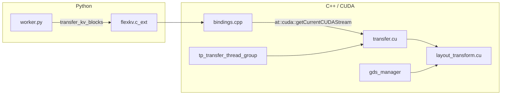

# MUSA Support System Design Document

This document describes the system design for adding Moore Threads MUSA GPU support to FlexKV, with a parallel API (nvcc→mcc, cuda*→musa*), leaving the existing CUDA implementation unchanged.

---

## 1. Understanding of Current CUDA Implementation

### 1.1 Architecture




### 1.2 CUDA-Related Surface


| Layer        | Files                                                                                                                             | CUDA usage                                                                                                                                                                      |
| ------------ | --------------------------------------------------------------------------------------------------------------------------------- | ------------------------------------------------------------------------------------------------------------------------------------------------------------------------------- |
| **Kernels**  | `csrc/transfer.cu`, `csrc/gds/layout_transform.cu`                                                                                | `__global__` kernels, `cudaStream_t`, `cudaMemcpyAsync`, `cudaStreamSynchronize`, `cudaOccupancyMaxActiveBlocksPerMultiprocessor`                                               |
| **Headers**  | `csrc/transfer.cuh`, `csrc/gtensor_handler.cuh`, `csrc/gds/layout_transform.cuh`                                                  | `#include <cuda_runtime.h>`, `__host__ __device__` in gtensor_handler                                                                                                           |
| **C++ host** | `csrc/bindings.cpp`, `csrc/tp_transfer_thread_group.cpp`, `csrc/gds/gds_manager.cpp`, `csrc/gds/tp_gds_transfer_thread_group.cpp` | `cudaStream_t`, `cudaMalloc`/`cudaFree`, `cudaMallocHost`/`cudaFreeHost`, `cudaSetDevice`, `cudaStreamCreate`/`Destroy`, `cudaGetLastError`, `at::cuda::getCurrentCUDAStream()` |
| **Build**    | `setup.py`                                                                                                                        | `cpp_extension.CUDAExtension`, nvcc for `.cu`, `-lcuda`; with GDS: `-lcufile`                                                                                                   |
| **Python**   | `flexkv/transfer/worker.py`, `flexkv/common/memory_handle.py`                                                                     | `torch.cuda.Stream`, `cudart.cudaHostRegister`/`cudaHostUnregister`, `cudart.cudaIpcGetMemHandle`/`cudaIpcOpenMemHandle`                                                        |


**API mapping (C++/CUDA → MUSA):**

- **Compiler:** `nvcc` → `mcc` (MUSA compiler).
- **Runtime types:** `cudaStream_t` → `musaStream_t`, `cudaError_t` → `musaError_t`.
- **Runtime APIs:** `cudaMalloc` → `musaMalloc`, `cudaFree` → `musaFree`, `cudaMallocHost` → `musaMallocHost`, `cudaFreeHost` → `musaFreeHost`, `cudaMemcpyAsync` → `musaMemcpyAsync`, `cudaStreamCreate`/`Destroy`/`Synchronize` → `musaStreamCreate`/`Destroy`/`Synchronize`, `cudaSetDevice`/`cudaGetDevice` → `musaSetDevice`/`musaGetDevice`, `cudaGetLastError`/`cudaSuccess`/`cudaGetErrorString` → `musaGetLastError`/`musaSuccess`/`musaGetErrorString`, `cudaOccupancyMaxActiveBlocksPerMultiprocessor` → MUSA occupancy API.
- **Kernel qualifiers:** `__global__`/`__device__`/`__host__` kept or mapped per MUSA SDK.
- **PyTorch / torch_musa:** MUSA has the **torch_musa** project (PyTorch for Moore Threads MUSA GPUs). The MUSA path uses `torch.musa` for current stream and device when available. See: [MooreThreads/torch_musa](https://github.com/MooreThreads/torch_musa).

### 1.3 Build and Entry Points

- **Build:** Single extension `flexkv.c_ext` in `setup.py` via `CUDAExtension`; sources include `transfer.cu` and, when `FLEXKV_ENABLE_GDS=1`, `gds/layout_transform.cu`. No CMake for CUDA.
- **Entry:** Python calls `flexkv.c_ext.transfer_kv_blocks` (and GDS/TP variants); bindings use `at::cuda::getCurrentCUDAStream()` and dispatch to `flexkv::transfer_kv_blocks<BackendType>`.

---

## 2. Design Principles

- **Same API shape:** MUSA mirrors CUDA (musa* types and functions; mcc for device code).
- **Zero impact on CUDA:** Existing CUDA sources and the current CUDA build path remain unchanged; no `#ifdef` inside current `.cu`/`.cpp` for MUSA.
- **TDD:** Tests added or specified first; implementation satisfies them (build, dispatch, and, where possible, correctness).
- **Backend abstraction first:** A unified `gpu_runtime` module is introduced *before* wiring any MUSA transfer path, ensuring every Python-level `torch.cuda.`* call goes through a single dispatch layer. This is the foundational design decision that makes the rest of the feature possible without scattering `if musa:` checks throughout the codebase.

---

## 3. Backend Abstraction Layer (`gpu_runtime`)

This is the **key design** of the MUSA feature. Rather than adding MUSA conditionals to every file that calls `torch.cuda`, we introduce a centralized backend abstraction module `flexkv/common/gpu_runtime.py` that all Python modules go through.

### 3.1 Architecture

```
┌──────────────────────────────────────────────────────────┐
│                     Python Modules                       │
│  worker.py  memory_handle.py  allocator.py  kvtask.py   │
│  transfer_engine.py  client.py  vllm_adapter  trtllm_*  │
└──────────────────────┬───────────────────────────────────┘
                       │ calls gpu_runtime.*
                       ▼
┌──────────────────────────────────────────────────────────┐
│           flexkv/common/gpu_runtime.py                   │
│                                                          │
│  get_gpu_backend() ──► "cuda" | "musa"                   │
│                                                          │
│  Device:    set_device, current_device, device_count     │
│  Stream:    create_stream, stream_context                │
│  Sync:      synchronize, empty_cache                     │
│  Host mem:  host_register, host_unregister               │
│  IPC:       ipc_get_mem_handle, ipc_open_mem_handle      │
│  Utility:   get_device_string, get_device, is_gpu_tensor │
│             is_initialized, init_runtime                 │
└─────────────┬──────────────────────┬─────────────────────┘
              │                      │
    ┌─────────▼──────────┐  ┌───────▼──────────────┐
    │   torch.cuda.*     │  │   torch.musa.*        │
    │   libcudart.so     │  │   libmusart.so        │
    └────────────────────┘  └───────────────────────┘
```

### 3.2 Detection and Dispatch

`get_gpu_backend()` checks (in order):

1. `os.environ["FLEXKV_GPU_BACKEND"]` — explicit override (for testing).
2. `torch.musa.is_available()` — MUSA hardware present.
3. `torch.cuda.is_available()` — fallback to CUDA.

When MUSA is selected but `torch.musa` is unavailable, all device/stream/sync functions raise `RuntimeError` rather than silently falling back to CUDA.

### 3.3 Call-Site Migration

All Python modules that previously called `torch.cuda.*` directly now go through `gpu_runtime`:


| Call site                            | Before                                                | After                                                          |
| ------------------------------------ | ----------------------------------------------------- | -------------------------------------------------------------- |
| `memory_handle.py` IPC export/import | `cudart.cudaIpcGetMemHandle` / `cudaIpcOpenMemHandle` | `gpu_runtime.ipc_get_mem_handle()` / `ipc_open_mem_handle()`   |
| `memory_handle.py` device strings    | `f"cuda:{device_id}"`                                 | `gpu_runtime.get_device_string(device_id)`                     |
| `allocator.py` device selection      | `torch.cuda.current_device()`                         | `gpu_runtime.current_device()`                                 |
| `transfer_engine.py` shutdown        | `torch.cuda.empty_cache(); synchronize()`             | `gpu_runtime.empty_cache(); synchronize()`                     |
| `worker.py` stream creation          | `torch.cuda.Stream()`, `torch.cuda.stream(s)`         | `gpu_runtime.create_stream()`, `gpu_runtime.stream_context(s)` |
| `kvtask.py` multi-node TP check      | `torch.cuda.device_count()`                           | `gpu_runtime.device_count()`                                   |
| Integration adapters                 | `torch.cuda.current_device()`, `device_count()`       | `gpu_runtime.current_device()`, `device_count()`               |
| `server/client.py` tensor check      | `tensor.is_cuda`                                      | `gpu_runtime.is_gpu_tensor(tensor)`                            |


### 3.4 Extension Module Dispatch

`flexkv/common/gpu_backend.py` provides:

- `get_gpu_backend() → str` — returns `"cuda"` or `"musa"`.
- `get_transfer_kv_blocks_module()` — returns `flexkv.c_ext_musa` (if MUSA and built) or `flexkv.c_ext`.

`flexkv/transfer/worker.py` uses this at import time:

```python
_transfer_module = get_transfer_kv_blocks_module()
transfer_kv_blocks     = _transfer_module.transfer_kv_blocks
transfer_kv_blocks_ssd = _transfer_module.transfer_kv_blocks_ssd
```

TP and GDS classes follow the same MUSA-first, CUDA-fallback pattern.

---

## 4. Proposed Architecture for MUSA

### 4.1 Strategy: Parallel MUSA Tree and Optional Extension

- **New code only under a dedicated subtree** (`csrc/musa/`):
  - MUSA-only sources that mirror the CUDA kernel + host logic using `musa_runtime.h` and `musa`* APIs.
  - Shared logic that does not touch CUDA (e.g. `GTensorHandler`, `BackendType`, `ptr_at`) can be reused via a header-only copy or shared include.
- **Build:**
  - **Default (CUDA):** Unchanged. `setup.py` keeps building `flexkv.c_ext` with nvcc and CUDA sources only.
  - **MUSA:** Gated by `FLEXKV_USE_MUSA=1`. Build a **second** extension `flexkv.c_ext_musa`. Compiles only MUSA sources with `mcc`, links `-lmusa`, and does **not** compile any of the current CUDA `.cu`/`.cpp`.

### 4.2 Component Mapping


| Component                | CUDA (current)                         | MUSA (new)                                         |
| ------------------------ | -------------------------------------- | -------------------------------------------------- |
| Transfer kernel + host   | `csrc/transfer.cu` / `transfer.cuh`    | `csrc/musa/transfer_musa.mu` + `transfer_musa.muh` |
| Layout transform (GDS)   | `csrc/gds/layout_transform.cu`         | `csrc/musa/gds/layout_transform_musa.mu`           |
| GTensorHandler           | `csrc/gtensor_handler.cuh`             | `csrc/musa/gtensor_handler_musa.h`                 |
| Bindings                 | `bindings.cpp`                         | `csrc/musa/bindings_musa.cpp`                      |
| TP transfer thread group | `tp_transfer_thread_group.cpp`         | `csrc/musa/tp_transfer_thread_group_musa.cpp`      |
| GDS manager              | `gds/gds_manager.cpp`                  | `csrc/musa/gds/gds_manager_musa.cpp`               |
| SSD transfer             | `csrc/transfer_ssd.cpp`                | Shared (pure CPU I/O, no GPU code)                 |
| Hash / Radix tree        | `csrc/hash.cpp`, `csrc/radix_tree.cpp` | Shared (pure CPU)                                  |
| CFS remote               | `csrc/pcfs/pcfs.cpp`                   | Shared (pure CPU I/O)                              |
| Python                   | `from flexkv.c_ext import ...`         | `from flexkv.c_ext_musa import ...`                |


### 4.3 Stream and Device Handling

- **CUDA:** `bindings.cpp` uses `at::cuda::getCurrentCUDAStream()`. No change.
- **MUSA:** `bindings_musa.cpp` uses `at::musa::getCurrentMUSAStream()` when MUSA SDK is available. Python backend abstraction handles stream creation via `gpu_runtime.create_stream()`.

---

## 5. TDD Strategy

### 5.1 Test-First Approach

1. **Build tests (no hardware)**
  When `FLEXKV_USE_MUSA=1` and MUSA SDK is present, run build and assert the MUSA extension builds. When MUSA is not requested, only `flexkv.c_ext` is in the extension list.
2. **Runtime dispatch tests**
  When MUSA is available and selected, the worker imports `c_ext_musa` and can call `transfer_kv_blocks` without crashing. When only CUDA is available, the existing `c_ext` path is used (no regression).
3. **Backend abstraction tests**
  `gpu_runtime` functions dispatch correctly; when MUSA is selected but `torch.musa` is unavailable, functions raise `RuntimeError` instead of silently using CUDA.
4. **Correctness / parity tests (MUSA hardware)**
  Reuse or mirror existing transfer tests to run the same transfer with CUDA and, on a MUSA machine, with MUSA; compare outputs. Use pytest markers for CUDA-only and MUSA-only tests.

### 5.2 Test Layout


| File                                 | Scope                                                       | Marker              |
| ------------------------------------ | ----------------------------------------------------------- | ------------------- |
| `tests/test_musa_build.py`           | Build config: extension list with/without `FLEXKV_USE_MUSA` | —                   |
| `tests/test_gpu_backend_dispatch.py` | Backend selection (CUDA vs MUSA), correct module resolution | —                   |
| `tests/test_gpu_runtime.py`          | `gpu_runtime` wrappers: device, stream, IPC, error handling | —                   |
| `tests/test_transfer_musa.py`        | MUSA transfer (stub or real) via `c_ext_musa`               | `@pytest.mark.musa` |


No new tests alter existing CUDA-only tests.

---

## 6. Implementation Phases

### Phase 1 — Build and Stub

- Add `flexkv/build_config.py`, `flexkv/common/gpu_backend.py`.
- Add `csrc/musa/bindings_musa.cpp` (stub `transfer_kv_blocks`), `csrc/musa/gtensor_handler_musa.h`.
- Extend `setup.py`: detect `FLEXKV_USE_MUSA`, `MUSA_HOME`, `mcc`; build `flexkv.c_ext_musa`.
- Add tests: `test_musa_build.py`, `test_gpu_backend_dispatch.py`, `test_transfer_musa.py`.
- Add all documentation under `docs/musa/`.

### Phase 2 — Transfer, Backend Abstraction, and GDS

- Implement `gpu_runtime.py` with full backend abstraction (device, stream, IPC, host mem, sync).
- Add `tests/test_gpu_runtime.py`.
- Implement MUSA transfer kernel: `transfer_musa.mu`, `transfer_musa.muh`.
- Implement MUSA TP transfer: `tp_transfer_thread_group_musa.cpp/.h`.
- Implement MUSA GDS: `csrc/musa/gds/` (gds_manager_musa, layout_transform_musa, tp_gds_transfer_thread_group_musa) with muFile APIs.
- Migrate all Python modules from `torch.cuda.`* to `gpu_runtime.*`.

### Phase 3 — SSD / CFS / Remote Transfer in c_ext_musa

- Expose SSD, hash, radix tree, CFS, and GDS bindings in `bindings_musa.cpp`.
- Reuse backend-agnostic C++ sources (`transfer_ssd.cpp`, `hash.cpp`, `radix_tree.cpp`).
- Update `setup.py` for shared sources and conditional CFS/GDS linking.
- Update `worker.py` import dispatch for full API surface.

---

## 7. Build with MUSA SDK

When `FLEXKV_USE_MUSA=1`, the default build produces a **C++-only** `flexkv.c_ext_musa` extension (stub `transfer_kv_blocks` and no TP). When the MUSA SDK and `mcc` are available:

- **Kernel/host:** `csrc/musa/transfer_musa.mu`, `csrc/musa/transfer_musa.muh`, `csrc/musa/gtensor_handler_musa.h` — compile with `mcc`; link with `-lmusa`. Integrates with **torch_musa** for stream/device.
- **TP transfer:** `csrc/musa/tp_transfer_thread_group_musa.cpp/.h` — uses `musa`* APIs.
- **SSD/Hash/Radix (always):** `csrc/transfer_ssd.cpp`, `csrc/hash.cpp`, `csrc/radix_tree.cpp` — pure CPU, shared with CUDA extension; link `-luring`, `-lxxhash`.
- **CFS (`FLEXKV_ENABLE_CFS=1`):** `csrc/pcfs/pcfs.cpp` + `-lhifs_client_sdk`.
- **GDS (`FLEXKV_ENABLE_GDS=1` + MUSA SDK):** `csrc/musa/gds/*.cpp` and `*.mu` + `-lmufile`.

---

## 8. GDS for MUSA (muFile)

cuFile APIs map 1:1 to muFile APIs:


| cuFile (CUDA)                                                 | muFile (MUSA)                                                 |
| ------------------------------------------------------------- | ------------------------------------------------------------- |
| `cuFileDriverOpen`                                            | `muFileDriverOpen`                                            |
| `cuFileHandleRegister` / `Deregister`                         | `muFileHandleRegister` / `Deregister`                         |
| `cuFileRead` / `cuFileWrite`                                  | `muFileRead` / `muFileWrite`                                  |
| `cuFileReadAsync` / `cuFileWriteAsync`                        | `muFileReadAsync` / `muFileWriteAsync`                        |
| `cuFileBatchIOSetUp` / `Submit` / `GetStatus` / `Destroy`     | `muFileBatchIOSetUp` / `Submit` / `GetStatus` / `Destroy`     |
| `CUfileHandle_t`, `CUfileDescr_t`, `CUfileError_t`            | `MUfileHandle_t`, `MUfileDescr_t`, `MUfileError_t`            |
| `CUfileBatchHandle_t`, `CUfileIOParams_t`, `CUfileIOEvents_t` | `MUfileBatchHandle_t`, `MUfileIOParams_t`, `MUfileIOEvents_t` |
| `CU_FILE_HANDLE_TYPE_OPAQUE_FD`                               | `MU_FILE_HANDLE_TYPE_OPAQUE_FD`                               |
| `CUFILE_BATCH` / `CUFILE_READ` / `CUFILE_WRITE`               | `MUFILE_BATCH` / `MUFILE_READ` / `MUFILE_WRITE`               |


MUSA GDS files live under `csrc/musa/gds/`:

- `gds_manager_musa.h` / `.cpp` — GDSManagerMusa class with muFile + musa* APIs.
- `layout_transform_musa.muh` / `.mu` — Layout transform kernel compiled with mcc.
- `tp_gds_transfer_thread_group_musa.h` / `.cpp` — TP GDS group using musa* streams and GDSManagerMusa.

