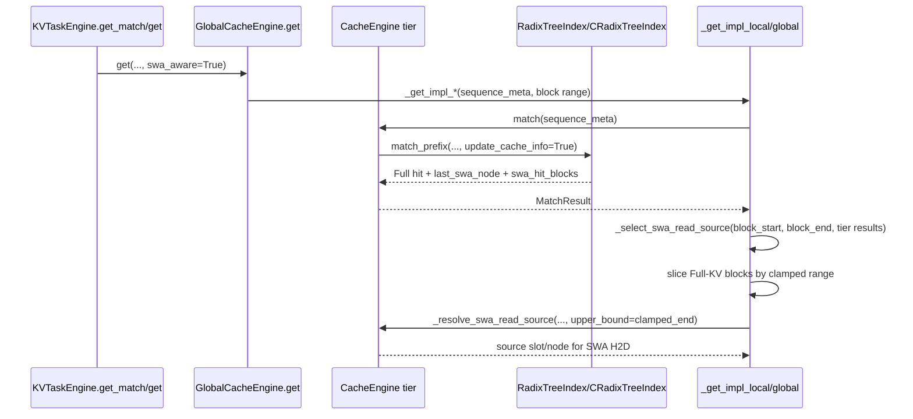
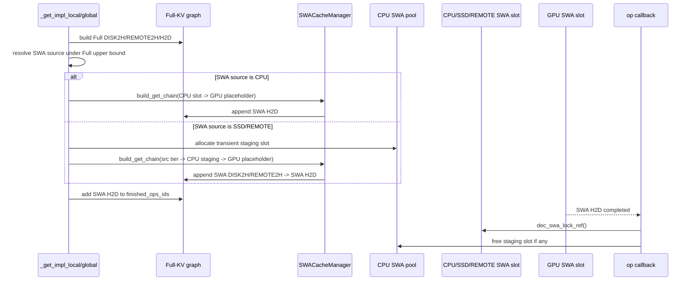
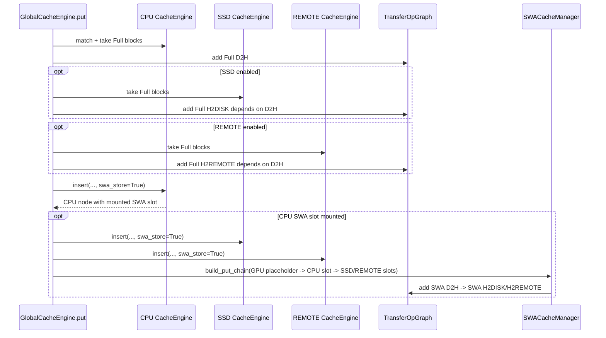
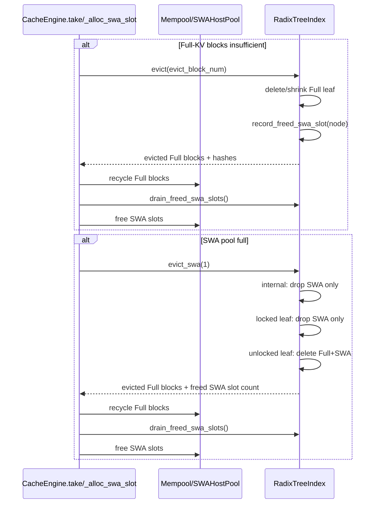
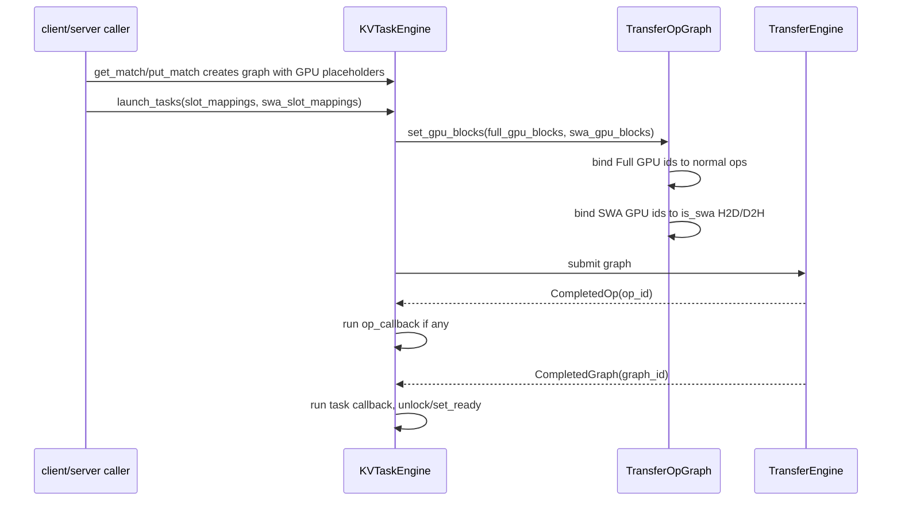

# SWA 适配逻辑 Feature 调用栈检视报告

检视入口：`flexkv/cache/cache_engine.py`

范围：SWA node-mounted 适配、SWA match、GET/PUT 搬运、Full-KV 分配/驱逐/回收、SWA-only eviction、launch/batch/server 接入、Python/C++ radix 不变量。

结论摘要：

- 方向是合理的：SWA 挂在 Full-KV radix node 上，match 同趟产出 Full hit 和 SWA hit，SWA ops 作为 `is_swa=True` peer ops 进入同一个 `TransferOpGraph`。
- 主要问题不在单个 helper，而在生命周期闭环：SWA slot 在 PUT 完成前已经对 match/eviction 可见，GET clamp 和 source selection 不是一个原子决策，batch/server/late-bind 接入没有完全跟上。
- 当前已有不少针对 node-mounted radix、SWA peer op、SSD staging、late-bind 的测试，但缺少跨 tier 非等长 SWA hit、PUT in-flight SWA 可见性、batch GET/PUT 完成语义、server RPC launch 的覆盖。

修复标记（2026-07-08）：

- 已修：server/client/request 的 `swa_slot_mappings` 透传和 server 关键字调用。
- 已修：SWA-aware clamp 与 source selection 合并，实际 source hit 必须等于最终 usable end。
- 已修：PUT SWA slot 延迟 `set_swa()` 到 PUT graph 完成后，避免早匹配和 in-flight eviction 回收。
- 已修：C++ root eviction guard。
- 已修：SWA load pin 采用 Full+SWA 成对 lock/release，不再长期违反 I3。
- 待讨论：修复优先级第 4 项 batch/REMOTE barrier 语义，明天和同事确认后再改。
- 待讨论：F7 里除 root guard / dual-lock 之外的 radix 等价性和 compaction 细节，明天和同事确认后再改。

检视分工：

- 主线：从 `cache_engine.py` 入口抽取主 feature，复核 subagent 结论，整理最终报告。
- Subagent 1：SWA match 与 SWA-aware clamp。
- Subagent 2：GET 搬运、staging、lock/release。
- Subagent 3：PUT 分配、写穿、ready 管理。
- Subagent 4：Full/SWA eviction、mempool、pool 回收。
- Subagent 5：radix 不变量、Python/C++ 等价性。

## Feature 列表

| Feature | 主要入口 | Full-KV 配合关系 | 风险等级 |
|---|---|---|---|
| F1 SWA tier 初始化和 gating | `GlobalCacheEngine.__init__`, `SWACacheManager.enabled` | 每个 Full-KV tier engine 自己持有一个 SWA host pool | 中 |
| F2 SWA match 与 SWA-aware clamp | `match()`, `_select_swa_read_source()`, `_resolve_swa_read_source()` | Full match 同趟带出 `last_swa_node/swa_hit_blocks` | 高 |
| F3 GET SWA 搬运、staging、release | `_get_impl_local/global`, `build_get_chain()` | SWA H2D 与 Full H2D 进入同一个 graph/barrier | 高 |
| F4 PUT SWA 分配、写穿、ready | `_put_impl_local/global`, `insert(..., swa_store=True)`, `build_put_chain()` | Full insert 后在 tail node 挂 SWA slot，SWA D2H/H2DISK/H2REMOTE 镜像 Full 写路径 | 高 |
| F5 Full 分配/驱逐/回收与 SWA-only eviction | `take()`, `recycle()`, `_evict_swa_slots()`, `evict_swa()` | Full eviction 释放 SWA slot；SWA-only eviction 必要时释放 Full leaf blocks | 高 |
| F6 Launch、batch、server 接入 | `KVTaskEngine.launch_tasks`, `TransferOpGraph.set_gpu_blocks`, server request | Full slot mapping 和 SWA slot mapping late-bind 到同一个 graph | 高 |
| F7 radix 不变量和 Python/C++ 等价性 | `radixtree.py`, `csrc/radix_tree.*` | radix tree 是 Full/SWA 位置一致性的 owner | 中 |

## F1 SWA tier 初始化和 gating

### 调用栈

```text
GlobalCacheEngine.__init__
  -> create CPU/SSD/REMOTE CacheEngineAccel or CacheEngine
     -> tier_swa_config = cache_config.swa.for_cache_tier(device_type)
     -> init_swa(tier_swa_config)
        -> SWAHostPool(config)
  -> self.swa_cache = SWACacheManager(self)
     -> enabled = cache_config.enable_swa_transfer and CPU tier has swa_pool
```

关键代码：

- `flexkv/cache/cache_engine.py:667` 创建 CPU tier 并传入 `swa_config=cache_config.swa`。
- `flexkv/cache/cache_engine.py:747` 创建 `SWACacheManager`。
- `flexkv/cache/swa_cache_engine.py:81` 用 `enable_swa_transfer` 和 CPU SWA pool 判断 graph 构造是否启用。
- `flexkv/common/config.py:467` 定义 `SWAPoolConfig`，`for_cache_tier()` 决定 CPU/SSD/REMOTE pool。

### 和 Full-KV 的配合

SWA pool 不是独立 cache engine。每个 Full-KV tier engine 仍然负责自己的 radix tree 和 mempool；SWA host pool 只是同 tier radix node 上的 slot id allocator。Full-KV 节点删除或结构变化时，radix tree 先 detach SWA slot，再由 engine drain 回 SWA pool。

### 风险

- `enable_swa_transfer=False` 时，`swa_cache.enabled=False`，PUT 不会 `swa_store`，GET SWA-aware clamp 也会得到 0 hit。这个行为和 `CacheConfig.enable_swa_transfer` 注释里“control plane works regardless”的说法不完全一致。见 `flexkv/common/config.py:582`、`flexkv/cache/cache_engine.py:2023`、`flexkv/cache/swa_cache_engine.py:81`。
- `HierarchyLRCacheEngine` 会初始化 SWA host pool，但 `_alloc_swa_slot()` 固定返回 `-1`，`_resolve_swa_read_source()` 固定 miss。P2P/hierarchical 路径配置 SWA 时会静默降级，且 match result 不透传 `last_swa_node/swa_hit_blocks`。见 `flexkv/cache/hie_cache_engine.py:103`、`flexkv/cache/hie_cache_engine.py:125`、`flexkv/cache/hie_cache_engine.py:146`、`flexkv/cache/hie_cache_engine.py:291`、`flexkv/cache/hie_cache_engine.py:356`。

## F2 SWA match 与 SWA-aware clamp

### 时序图



### 调用栈

```text
GlobalCacheEngine.get
  -> _get_impl_local / _get_impl_global
     -> match_local[_accel] / match_all[_accel]
        -> CacheEngine[Accel].match
           -> index.match_prefix(...)
              -> returns Full match + last_swa_node + swa_hit_blocks
     -> _select_swa_read_source(...)
        -> choose final usable end and exact source together
     -> _resolve_swa_read_source(...)
```

关键代码：

- Python match：`flexkv/cache/radixtree.py:364`
- C++ match：`csrc/radix_tree.cpp:606`
- Accel wrapper 透传 SWA fields：`flexkv/cache/cache_engine.py:293`
- clamp：`flexkv/cache/cache_engine.py:2014`
- source resolve：`flexkv/cache/cache_engine.py:176`

### 和 Full-KV 的配合

`match_prefix` 只在“整节点 fully matched 且 ready”时暴露该节点的 SWA，因为 SWA slot 表示节点最后一页的 window。partial node match 不可使用尾页 SWA。这个和 Full-KV prefix match 是同一趟遍历，避免二次 tree walk。

### Bug / 风险

#### P0: clamp end 和实际 SWA source 可能不一致

原实现 `_clamp_end_to_swa()` 取跨 tier 最大 `swa_hit_blocks`，但 source loop 按 CPU -> SSD -> REMOTE 选择第一个 `0 < swa_hit <= upper_bound` 的源。例子：CPU SWA hit=4，SSD SWA hit=8，Full hit=8。Full window 会 clamp 到 8，但 SWA source 会先选 CPU 的 block 4 window，最终 Full-KV 和 SWA window 不一致。

2026-07-08 已修：`_clamp_end_to_swa()` 已被 `_select_swa_read_source()` 替代，最终 usable end 与实际 source 在同一个决策里产生，并要求 source hit 等于 usable end。

相关代码：

- `flexkv/cache/cache_engine.py:2023` 取 best/max SWA hit。
- `flexkv/cache/cache_engine.py:191` 只排除 `swa_hit > upper_bound`，不要求 `swa_hit == upper_bound`。
- `flexkv/cache/cache_engine.py:1119` global GET source loop。
- `flexkv/cache/cache_engine.py:1410` local GET source loop。

建议：把 clamp 和 source selection 合成一个 helper，例如 `select_swa_source_for_usable_end(tier_results, preferred_tiers)`，返回 `(usable_end, source_tier, source_slot, source_node)`。如果最终 usable end 是 8，就只允许选择 `swa_hit == 8` 的源；否则应降级 usable end 到所选源的 hit。

#### P1: SWA load pin 绕过 tree-level dual-lock API

radix tree 里有 `inc_lock_ref/dec_lock_ref/dec_swa_lock_only`，注释声明 I3：`lock_cnt >= swa_lock_ref`。但 GET source pin 直接 `node.inc_swa_lock_ref()`，不增加 Full lock。功能上 `in_use()` 会看 `swa_lock_ref`，但实现偏离了 dual-lock 模型，且在 source node 不是最终 `node_to_unlock` 时 I3 会长期不成立。

相关代码：

- `flexkv/cache/cache_engine.py:169` `_pin_swa_node()`
- `flexkv/cache/cache_engine.py:205` `_resolve_swa_read_source()` promote + pin
- `flexkv/cache/cache_engine.py:2055` `_swa_release_load_lock()`
- `flexkv/cache/radixtree.py:638` Python dual-lock API
- `csrc/radix_tree.cpp:560` C++ dual-lock API

#### P2: P2P/hierarchical match 丢 SWA fields

`HierarchyLRCacheEngine.match_all()` / `match_local()` 返回 `MatchResultAccel` 时没有填 `last_swa_node/swa_hit_blocks`。如果该路径启用 SWA config，上层 clamp 只能看到 0。

相关代码：

- `flexkv/cache/hie_cache_engine.py:291`
- `flexkv/cache/hie_cache_engine.py:356`
- `flexkv/cache/hie_cache_engine.py:103`

## F3 GET SWA 搬运、staging、release

### 时序图



### 调用栈

```text
_get_impl_local / _get_impl_global
  -> build Full-KV transfer graph
  -> for tier in CPU, SSD, REMOTE:
       engine._resolve_swa_read_source(..., lock_for_load=True)
       if source tier != CPU:
           cpu_engine._alloc_swa_slot()  # transient staging
       self.swa_cache.build_get_chain(...)
       op_callback_dict[swa_h2d_id] = _swa_release_load_lock(...)
       finished_ops_ids.append(swa_h2d_id)
       break
```

关键代码：

- local GET SWA append：`flexkv/cache/cache_engine.py:1407`
- global GET SWA append：`flexkv/cache/cache_engine.py:1116`
- build chain：`flexkv/cache/swa_cache_engine.py:126`
- release callback：`flexkv/cache/cache_engine.py:2055`
- graph barrier：`flexkv/cache/cache_engine.py:870`

### 和 Full-KV 的配合

SWA GET 是 Full GET 的 peer graph。Full-KV 决定本次可返回多少 blocks；SWA-aware path 再要求 Full window 不超过 SWA reusable window。SWA H2D 加入同一个 virtual barrier，单请求里上层只有在 Full H2D 和 SWA H2D 都完成后才看到 task end。

### Bug / 风险

#### P1: batch GET 可能早返回，未等待 SWA H2D

单请求 `finished_ops_ids` 会通过 virtual op 等 Full H2D 和 SWA H2D。batch merge 后 `batch_end_op_id` 优先选 main H2D，SWA H2D 不一定参与 task end。`KVTaskEngine.check_completed(completely=False)` 在 `task_end_op_finished` 即可返回 success，因此 batch GET 可能在 SWA H2D 仍未完成时对上层报告完成。

相关代码：

- 单请求 barrier：`flexkv/cache/cache_engine.py:870`
- batch end 选择：`flexkv/common/transfer.py:723`
- early success：`flexkv/kvtask.py:364`

建议：batch GET 也需要重新建一个 virtual end op，依赖 main H2D 和 SWA H2D；或把 `batch_end_op_id` 选为覆盖全部 terminal ops 的虚拟 op。

#### P1: batch merge 不支持 SWA REMOTE2H

global GET 可以构造 `SWA REMOTE2H -> SWA H2D`，但 `merge_to_batch_graph()` 的 SWA 支持类型只包含 H2D/DISK2H/D2H/H2DISK，遇到 REMOTE2H 会抛 `NotImplementedError`。如果异常发生在 plan 已经 pin source node 或分配 staging slot 之后，缺少 cleanup。

相关代码：

- global GET remote SWA：`flexkv/cache/cache_engine.py:1150`
- build remote chain：`flexkv/cache/swa_cache_engine.py:156`
- batch SWA type filter：`flexkv/common/transfer.py:577`

#### P2: cancel/launch 失败路径不会释放 SWA pin 或 staging slot

SWA source pin 和 transient staging slot 只在 SWA H2D op callback 中释放。任务取消、batch merge 抛错、launch 前失败时，不会执行 op callback 或总 callback。

相关代码：

- pin/staging 分配：`flexkv/cache/cache_engine.py:1127`、`flexkv/cache/cache_engine.py:1141`
- release callback：`flexkv/cache/cache_engine.py:2055`
- cancel path：`flexkv/kvtask.py:356`

## F4 PUT SWA 分配、写穿、ready

### 时序图



### 调用栈

```text
GlobalCacheEngine.put
  -> _put_impl_local / _put_impl_global
     -> match tiers
     -> take Full-KV physical blocks
     -> build Full-KV D2H/H2DISK/H2REMOTE
     -> cpu_cache_engine.insert(..., swa_store=self.swa_cache.enabled)
        -> index.insert(...)
        -> _reserve_swa_tail_slot(node)
           -> _alloc_swa_slot()
           -> index.set_swa(node, slot)
           -> _drain_unmounted_swa_slots()
     -> lower-tier insert(..., swa_store=write_swa_through)
     -> self.swa_cache.build_put_chain(...)
```

关键代码：

- local PUT：`flexkv/cache/cache_engine.py:1756`
- global PUT：`flexkv/cache/cache_engine.py:1541`
- insert + `swa_store`：`flexkv/cache/cache_engine.py:323`、`flexkv/cache/cache_engine.py:522`
- reserve/mount：`flexkv/cache/cache_engine.py:141`
- build put chain：`flexkv/cache/swa_cache_engine.py:165`

### 和 Full-KV 的配合

Full-KV 必须先 insert 出 store node，SWA 才能挂到该 node 的 trailing page。SWA lower-tier 写穿只在 CPU SWA store 成功后发生，因为 CPU SWA slot 同时是 GPU->CPU D2H 的目的地和 CPU->SSD/REMOTE 写穿源。

### Bug / 风险

#### P0: PUT node ready 可能早于 SWA bytes 写完成

local PUT 把 CPU node ready callback 绑在 Full-KV D2H 上，把 SSD node ready callback 绑在 Full-KV H2DISK 上；但 SWA D2H/H2DISK 没有参与 ready callback。`match_prefix` 只要 node ready 且 `has_swa()` 就暴露 SWA hit，因此 Full-KV 完成但 SWA 仍在写时，后续 GET 可能读取 stale/unwritten SWA slot。

相关代码：

- CPU ready on Full D2H：`flexkv/cache/cache_engine.py:1889`
- SSD ready on Full H2DISK：`flexkv/cache/cache_engine.py:1899`
- SWA put chain 没有 ready callback：`flexkv/cache/cache_engine.py:1906`
- match 暴露 ready SWA：`flexkv/cache/radixtree.py:388`

建议：SWA slot 需要显式 in-flight 状态，或把 node ready 拆成 Full ready 和 SWA ready。最小修复是对带 SWA slot 的 node，将 ready callback 延后到 SWA D2H/H2DISK/H2REMOTE 对应 op 完成后，且 Full/SWA 都完成才暴露 `has_swa()`。

#### P0: in-flight SWA PUT slot 可被 SWA-only eviction 回收

PUT insert 时先分配并挂载 SWA slot，但这个 slot 没有 `swa_lock_ref`，SWA-only eviction 只避开 `swa_lock_ref > 0`，不避开 not-ready 或 full-locked node。pool 满时可能回收正在写入的 SWA slot，随后 in-flight transfer 写入已复用 slot，造成跨节点污染。

相关代码：

- mount before transfer completion：`flexkv/cache/cache_engine.py:141`
- lock nodes happens after plan build：`flexkv/cache/cache_engine.py:1524`
- SWA LRU skips only `swa_lock_ref > 0`：`flexkv/cache/radixtree.py:282`
- leaf with full lock still drops SWA：`flexkv/cache/radixtree.py:583`

建议：PUT SWA slot 在 D2H/H2DISK/H2REMOTE 完成前应有 write pin，或者在 transfer 完成后再 `set_swa()` 挂载。后者语义更干净，但需要在 op callback 中拿到 node/slot。

#### P1: PUT task_end 与 graph complete 语义不一致

PUT 的 `finished_ops_ids` 只包含 Full-KV D2H 和 SWA D2H，不包含 Full/SWA 写穿到 SSD/REMOTE 的 ops。`wait(completely=False)` 可以在 task end 后返回 success，但 lower-tier 写穿和最终 task callback 可能还没完成。

相关代码：

- Full D2H reported：`flexkv/cache/cache_engine.py:1655`
- SWA D2H reported：`flexkv/cache/cache_engine.py:1744`
- early success：`flexkv/kvtask.py:364`

#### P2: SWA GPU placeholder 可能被真实使用

SWA GPU side 初始是 `_SWA_GPU_PLACEHOLDER = [0]`。如果 `enable_swa_transfer=True` 且 graph 被提交，但 launch 没有传 `swa_slot_mapping`，`set_gpu_blocks()` 会保留 placeholder，SWA PUT 会从 GPU SWA slot 0 读，GET 会写到 slot 0。

相关代码：

- placeholder：`flexkv/cache/cache_engine.py:2053`
- late-bind preserve path：`flexkv/kvtask.py:396`
- `TransferOpGraph.set_gpu_blocks()` 对 SWA op 无 mapping 时 continue：`flexkv/common/transfer.py:315`

建议：当 graph 含 SWA GPU op 且 transfer enabled 时，launch 必须要求 `swa_slot_mapping`，否则报错或显式 strip SWA ops。

## F5 Full 分配/驱逐/回收与 SWA-only eviction

### 时序图



### 调用栈

```text
Full allocation:
CacheEngine[Accel].take
  -> if utilization high or demand > free:
       index.evict(...)
       mempool.recycle_blocks(evicted_blocks)
       _drain_unmounted_swa_slots()
  -> mempool.allocate_blocks(...)

SWA allocation:
_alloc_swa_slot
  -> swa_pool.allocate()
  -> if full:
       _evict_swa_slots(1)
       swa_pool.allocate()

SWA-only eviction:
_evict_swa_slots
  -> index.evict_swa(...)
  -> mempool.recycle_blocks(evicted_full_blocks)
  -> _drain_unmounted_swa_slots()
```

关键代码：

- Full take/evict accel：`flexkv/cache/cache_engine.py:368`
- Full take/evict Python：`flexkv/cache/cache_engine.py:551`
- SWA allocation：`flexkv/cache/cache_engine.py:106`
- SWA eviction Python：`flexkv/cache/radixtree.py:553`
- SWA eviction C++：`csrc/radix_tree.cpp:516`
- freed slot drain：`flexkv/cache/radixtree.py:303`、`csrc/radix_tree.h:591`

### 和 Full-KV 的配合

Full eviction 释放 SWA slot，确保 SWA 是 Full 的子集。SWA-only eviction 尽量不动 Full：内部 node 只丢 SWA，Full-locked leaf 只丢 SWA，unlocked leaf 丢 SWA 后没有意义，所以 Full leaf 也一起释放并回收 mempool。

### Bug / 风险

#### P1: C++ root 可被当作 eviction candidate

Python `RadixNode.evictable()` 排除 root，但 C++ `CRadixNode::evictable()` 只判断 `is_leaf() && !in_use()`。Full eviction 删除最后一个 leaf 后，parent 是 root，`parent->evictable()` 可能把 root 推入 candidate；如果 `num_evicted` 仍未满足，下一轮 `detach_leaf_collect(root, ...)` 会触发断言或空指针风险。

相关代码：

- Python root guard：`flexkv/cache/radixtree.py:121`
- C++ no root guard：`csrc/radix_tree.h:249`
- parent requeue：`csrc/radix_tree.cpp:476`
- detach leaf assert parent：`csrc/radix_tree.cpp:361`

建议：C++ `evictable()` 加 `!index->is_root(this)` 或在 parent requeue 前显式 `!is_root(parent)`。

#### P2: `SWAHostPool.free()` 对重复 free 静默忽略

这能避免生产崩溃，但会掩盖 tree 侧重复释放 bug。Full `Mempool.recycle_blocks()` 对 double free 更严格。

相关代码：

- `flexkv/swa/swa_host_pool.py:35`
- `flexkv/cache/mempool.py:63`

建议：生产可以保留幂等防御，但测试模式应 assert duplicate free。

## F6 Launch、batch、server 接入

### 时序图



### 调用栈

```text
KVTaskEngine.launch_tasks
  -> set_slot_mappings(task_ids, slot_mappings, swa_slot_mappings)
     -> _set_slot_mapping_impl
        -> cache_engine.slot_mapping_to_block_ids(full)
        -> cache_engine.slot_mapping_to_block_ids(swa)
        -> graph.set_gpu_blocks(graph_ids, swa_graph_ids)
  -> optionally merge_to_batch_graph(...)
  -> transfer_handle.submit(graph, task_end_op_id=...)
```

关键代码：

- `flexkv/kvtask.py:846`
- `flexkv/kvtask.py:387`
- `flexkv/common/transfer.py:315`
- `flexkv/common/transfer.py:366`

### Bug / 风险

#### P0: server launch 参数错位，且 RPC request 没有 SWA slot mappings

`KVTaskEngine.launch_tasks()` 第三个参数是 `swa_slot_mappings`，但 server 用位置参数把 `req.as_batch` 传给了第三参。`LaunchTaskRequest` 和 client method 也没有 `swa_slot_mappings` 字段。server 模式下，SWA late-bind 不可用，且 bool 会被当作 iterable SWA mappings 传入 `set_slot_mappings`。

相关代码：

- server 位置参数调用：`flexkv/server/server.py:457`
- launch_tasks 签名：`flexkv/kvtask.py:846`
- client 缺少 `swa_slot_mappings`：`flexkv/server/client.py:192`
- request 缺少字段：`flexkv/server/request.py:93`

建议：改为关键字参数调用，并在 `LaunchTaskRequest` / client API 增加 `swa_slot_mappings: Optional[List[Optional[np.ndarray]]]`。

#### P1: batch merge 不支持 REMOTE Full/SWA ops，但 launch 允许 remote PUT/GET batch

`merge_to_batch_graph()` 只支持 DISK2H/H2D/D2H/H2DISK。global GET/PUT 会出现 REMOTE2H/H2REMOTE，SWA 也可能出现 REMOTE2H/H2REMOTE。`launch_tasks(..., as_batch=True)` 没有按 graph type 拦截。

相关代码：

- supported types：`flexkv/common/transfer.py:565`
- SWA unsupported branch：`flexkv/common/transfer.py:577`
- all GET/PUT 可以 batch：`flexkv/kvtask.py:862`
- global PUT remote op：`flexkv/cache/cache_engine.py:1682`
- global GET remote SWA op：`flexkv/cache/cache_engine.py:1150`

## F7 radix 不变量和 Python/C++ 等价性

### 不变量

- I0：每个 node 最多一个 SWA，表示 node trailing page。split 时 SWA 留在 suffix；merge 时 SWA 跟随 child 的最后一页。
- I1：SWA 是 Full 的子集。Full 删除或 trailing page 改变时必须释放 SWA slot。
- I2：无 SWA、无 Full lock、ready 的 leaf 没有意义，应级联删除。
- I3：设计声明 `full_lock_ref >= swa_lock_ref`。
- I4：只有整节点 match 且 ready 的节点才能贡献 SWA hit。

### Python/C++ 对齐点

- `match_prefix` 都只在整节点 match 时暴露 SWA：`flexkv/cache/radixtree.py:418`、`csrc/radix_tree.cpp:654`。
- `promote_swa` 都移动 SWA-LRU 位置，而不只是更新时间：`flexkv/cache/radixtree.py:325`、`csrc/radix_tree.h:543`。
- `evict_swa` 三分支语义一致：internal drop SWA only；locked leaf drop SWA only；unlocked leaf delete Full+SWA：`flexkv/cache/radixtree.py:553`、`csrc/radix_tree.cpp:516`。

### Bug / 风险

#### P2: Python `merge_child()` bookkeeping 不完整

Python tree-level `merge_child()` 调 `node.merge_child()` 后只处理 SWA handoff，没有从 `leaf_nodes` 删除 child，也没有断开 child parent。当前主路径没有调用它，测试也偏向直接验证 SWA handoff；如果未来用于真实 compaction，会留下 stale leaf。

相关代码：

- Python tree merge：`flexkv/cache/radixtree.py:339`
- Python node merge 只 clear children：`flexkv/cache/radixtree.py:191`
- C++ merge 会清理 child：`csrc/radix_tree.cpp:235`

#### P3: C++ probe 仍记录 cache metrics

`_probe_swa_source()` 明确是 read-only bounded probe，但 C++ `match_prefix(..., update_cache_info=false)` 仍记录 HIT/MATCH/MISS metrics。它不更新 heat，不影响正确性，但会污染统计。

相关代码：

- probe：`flexkv/cache/cache_engine.py:274`
- C++ metrics：`csrc/radix_tree.cpp:737`

## 已复核排除的疑点

- “C++ split 后 suffix leaf 从 `leaf_list` 消失”未列为 bug。Python 需要 pop/re-add 是因为 `leaf_nodes` 是按 head hash keyed 的 dict；C++ `leaf_list` 是 vector，原 suffix node 保持在 vector 里即可，split 后不需要重新登记。
- “SWA write-through fire-and-forget 本身就是错”未列为单独 bug。fire-and-forget 可以成立，但前提是 ready/visible 语义不能早于对应 SWA bytes 完成；当前问题是 ready 和 task_end 语义没有清楚区分。

## 实现简洁性和优雅度评价

做得好的地方：

- node-mounted SWA 是正确的收敛方向：Full 和 SWA 共用一棵 radix tree，位置一致性比独立 SWA index 更容易维护。
- `SWACacheManager` 职责很窄，只把已解析的 SWA slot ids 追加成 peer ops；match、slot 分配、pin、ready 都留在 engine/radix 层。
- `TransferOp.is_swa=True + 标准 TransferType` 复用已有 data-plane 类型，接口面相对小，后续 worker 路由也清晰。
- Python/C++ radix 的注释和测试覆盖比较充分，尤其是 split、partial match、SWA-LRU promote、SWA-only eviction 这些核心不变量。

不够优雅的地方：

- GET 的 clamp 和 source selection 分散在两个阶段，且 `_get_impl_local` / `_get_impl_global` 各写一遍，导致“最大 SWA hit”和“实际 source slot”没有同一个 owner。
- PUT 没有显式建模 SWA in-flight 状态，slot 一挂到 node 上就同时进入可 match、可 eviction、可 transfer 的状态空间。
- ready、task_end、graph complete 三个完成语义混在一起，Full-KV 原本能勉强成立，加入 SWA 写穿后语义裂缝明显扩大。
- server/RPC、batch merge、P2P/hierarchical 路径没有和主控制面同时收口，说明 SWA 接入还停在“核心路径跑通”，不是“所有入口一致可用”。

## 建议的修复优先级

1. 修 `server/client/request` 的 `swa_slot_mappings` 透传和 `launch_tasks` 关键字调用。
2. 把 SWA-aware clamp 与 source selection 合并，要求实际 source hit 等于最终 usable end。
3. 给 PUT SWA slot 增加 in-flight 状态或延迟 `set_swa()` 到 SWA transfer 完成后，避免早匹配和 eviction 回收。
4. batch merge 重新建立包含 SWA terminal ops 的 barrier，并明确支持或拒绝 REMOTE ops。**待明天和同事讨论后再改。**
5. C++ root eviction guard。
6. 统一 dual-lock 使用方式，至少不要让 `_pin_swa_node()` 长期违反 I3。
7. 为 P2P/hierarchical SWA config 做显式 unsupported guard，避免静默 no-op。

## 需要补的测试

- CPU SWA hit 短于 SSD SWA hit 时，`swa_aware=True` 必须选择 exact source 或降级 Full window。
- Full D2H 先完成、SWA D2H 后完成时，GET 不应暴露 SWA hit。
- SWA pool 满时，in-flight PUT SWA slot 不应被 `evict_swa()` 回收。
- batch GET 同时含 Full H2D 和 SWA H2D 时，`wait(completely=False)` 不应早于 SWA H2D。
- server mode `LaunchTaskRequest` 传递 `swa_slot_mappings`。
- C++ `evict()` 请求量大于 cached blocks 时不能把 root 当 leaf evict。

备注：F7 的 root guard 与 load-pin I3 已先行修复；其它 radix 等价性问题（例如 compaction/metrics 语义）暂按“待讨论”处理。
