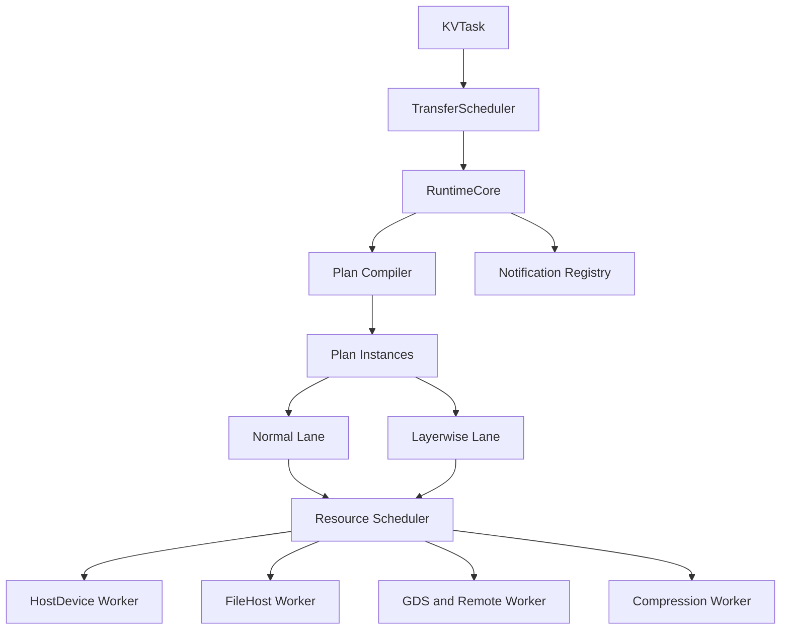
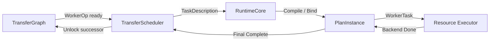
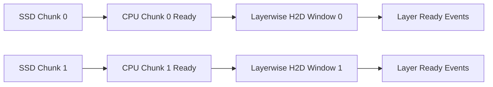
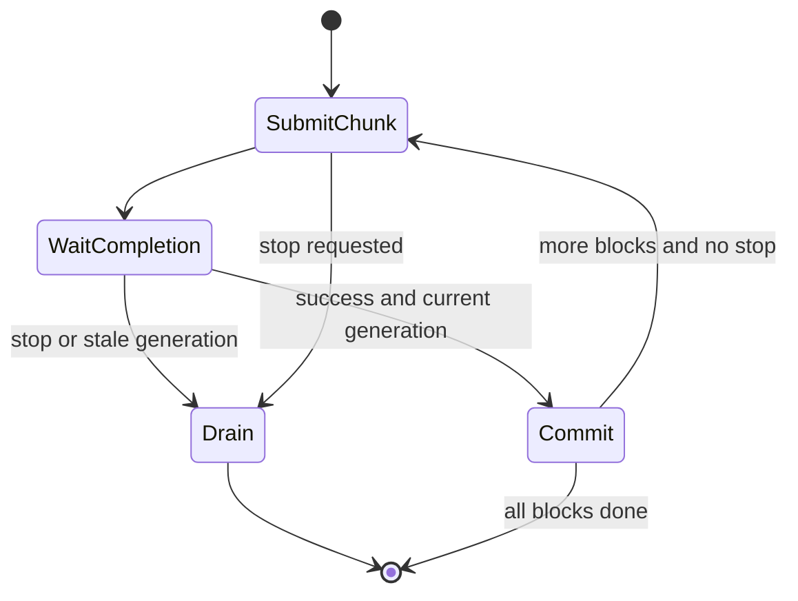

# FlexKV Transfer Runtime 重构方案
状态：架构评审稿  
目标读者：FlexKV、推理引擎、存储与性能相关开发者

本文描述的是完整目标形态。**当前这一轮重构只落地了其中不需要 C++ RuntimeCore 的部分**：
Plan 表达（第 4 章）落在 Python 侧的 transfer template 编译器上，两条 lane（第 5 章）
退化为普通/layerwise 共用一个 worker 的两种 completion contract，Worker 按资源而非模型
划分（第 3 章）则完整落地。RuntimeCore、PlanTemplate 缓存、C++ 侧调度和第 9 章 Phase 5
之后的内容都还没有实现——读代码时以本文的问题陈述（第 1 章）和目标（第 2 章）为准，
架构细节请以实际代码为准。

## 1. 背景
FlexKV 已支持 CPU、GPU、SSD、Remote、GDS、TP/PP、SWA、Multi-group、Layerwise 和压缩传输，但当前架构逐渐暴露出以下问题。
### 1.1 Python GIL 带来的线程/进程权衡
现有 Transfer Worker 使用独立 Python 进程规避 GIL，但也引入了 Pipe、pickle、CUDA IPC、重复 CUDA Context、重复内存注册和复杂的进程生命周期。

Python 3.14t 不是可靠前提：它是可选 ABI，且 PyTorch 和其他扩展仍需验证。因此数据面不应依赖 Python 是否有 GIL，而应放入不访问 Python 对象的 C++ 线程。
### 1.2 Latency 与 Throughput 难以同时优化
普通传输倾向于大 batch，以提高带宽；Layerwise 传输倾向于小粒度，以尽快完成第一层。当前两类路径由不同 Worker 特殊处理，缺少统一的资源配额、公平性和优先级。
### 1.3 每增加一种模型状态就增加重复代码
当前 `WorkerOp` 主要表达 src/dst block IDs，无法直接描述 Full KV、SWA、Indexer State、LayerGroup、TP shard 等内容。模型语义被分散在 Worker 类型、构造参数和大量分支中。

新增 Linear Attention 等状态时，容易继续增加 Worker、字段和特殊路径。
### 1.4 Layerwise 中 SSD 与 GPU 传输不能并行
当前 Layerwise 路径先完成所有 SSD→CPU，再开始逐层 CPU→GPU。结果是：

- 第一层必须等待完整 SSD 请求；
- SSD 与 H2D 无法流水；
- SSD 读取粒度无法独立控制；
- SSD 阶段无法提前停止。
### 1.5 Prefetch 缺少 chunk 和提前终止
大规模 prefetch 需要按 chunk 提交。收到停止请求后，应停止后续 chunk，并安全 drain 已提交 IO/DMA；当前没有统一的 generation、lease 和 stale completion 语义。
### 1.6 Worker 偏离“只控制一种资源”的初衷
部分 Worker 同时解释模型、计算布局、选择 backend、管理 TP/PP、执行 SSD/H2D、聚合完成并发送 eventfd，职责过重，也难以复用。
### 1.7 Completion 回调路径可能过长
如果每个 primitive 完成都经过 Worker 进程、Python queue、Scheduler，再触发下一个 primitive，调度时间会随 layer/component/rank 数放大。部分异步路径还可能把“已提交”误认为“已完成”。
### 1.8 必须保留 Layerwise 能力
重构不是删除 Layerwise，而是保留并强化：

- per-layer ready；
- eventfd 通知；
- Full/SWA/Multi-group/TP 聚合；
- 低首层延迟；
- 与普通传输共享资源且互不饿死。

## 2. 设计目标
1. Python 只负责逻辑 DAG、事务和 Prefetch Session。
2. C++ RuntimeCore 负责 WorkerOp 内的编译、调度和完成。
3. Worker 按资源类型划分，不按模型类型划分。
4. 新模型主要注册 schema/layout，而不是新增 Worker。
5. primitive completion 留在 C++，Python 通常只接收 WorkerOp 最终完成。
6. Normal 优先吞吐，Layerwise 优先首层延迟，并统一仲裁资源。
7. SSD→CPU 与 Layerwise CPU→GPU 解耦。
8. 保留 CE、CUDA kernel、io_uring、GDS、NIXL 和 Compression。

## 3. 总体架构

### 3.1 组件架构



RuntimeCore 由 Python 通过 pybind 创建，内部启动 `std::thread`。C++ 线程不访问 `PyObject`，因此不受 GIL 限制，也不依赖 Python 3.14t。
### 3.2 两级调度边界

| 组件 | 负责 | 不负责 |
|---|---|---|
| TransferScheduler | WorkerOp 依赖、事务、publication/rollback、Prefetch Session | layer/rank primitive、CUDA event、Worker 选择 |
| RuntimeCore | Plan 编译、双 lane、credits、primitive 依赖、完成聚合 | Python callback、cache tree 修改 |
| Resource Executor | 单资源边上的 backend 执行和真实完成 | 模型语义、跨资源 DAG |

默认每个 WorkerOp 只与 Python通信两次：提交一次、最终完成一次。

## 4. Plan 的表达
Plan 是本方案的关键：它把一个逻辑 WorkerOp 显式展开为 component、layer、rank 和依赖关系。
### 4.1 模板与实例
```text
PlanTemplate
  静态：schema、layout、component、layer/rank DAG、capability、batching key
  可跨请求复用

PlanInstance
  动态：src/dst block IDs、generation、lease、counter_id、priority
  只对应一次 WorkerOp
```
### 4.2 示例：Full KV + SWA 的 Layerwise H2D
```yaml
plan_template:
  name: layerwise_h2d_full_swa_tp2
  edge: CPU_TO_GPU
  lane: LAYERWISE
  completion: PER_ORIGINAL_LAYER

  components:
    - id: full_kv
      index_space: full_cpu_blocks -> full_gpu_blocks
      layers: original_layer_to_full_members
      tp_ranks: [0, 1]
    - id: swa_kv
      index_space: swa_cpu_blocks -> swa_gpu_blocks
      layers: original_layer_to_swa_members
      tp_ranks: [0, 1]

  nodes:
    - copy:
        for_each: [original_layer, tp_rank]
        regions: [full_kv_members, swa_kv_members]
        executor: host_device
        batching_key: [gpu, layout, layer]

    - layer_join:
        for_each: [original_layer, tp_rank]
        depends_on: all_required_component_copies

    - signal:
        for_each: [original_layer, tp_rank]
        depends_on: layer_join
        action: eventfd_write_once

    - finalize:
        depends_on: all_copies_and_signals
```
请求到达时只绑定动态内容：
```yaml
plan_instance:
  logical_op_id: 3107
  generation: 12
  full_mapping: {src: [...], dst: [...]}
  swa_mapping:  {src: [...], dst: [...]}
  counter_id: 4
  destination_lease: {id: 91, epoch: 8}
```
WorkerTask 可以包含同层的 Full KV、SWA 和其他 state，以便 Worker 融合执行；但一个 WorkerTask 只能跨一条资源边。

## 5. Normal、Layerwise 与资源仲裁
只建立一个 RuntimeCore，内部使用两条 lane：
```text
Normal Lane
  大 batch、允许短 batching delay、优先稳定吞吐

Layerwise Lane
  小 layer 粒度、高优先级 stream、优先 first-layer-ready
```
两条 lane 共享 GPU、PCIe、CPU staging 和 stream credits：

- Layerwise 预留少量 credits，防止被大任务阻塞；
- Normal 使用 weighted fairness 和 aging，防止永久饿死；
- Prefetch 属于后台 service class，有独立 in-flight 上限；
- 所有任务都必须通过 bytes、descriptor、backend queue-depth 和 slot lease 准入。

## 6. Layerwise、SSD 流水与 Prefetch
### 6.1 SSD/H2D 解耦

SSD→CPU 使用 Normal/Prefetch lane，CPU→GPU 使用 Layerwise lane。两者通过 CPU range lease 和 `BACKEND_DONE` 建立依赖。

第一版可以在 Python roundtrip 后启动 H2D；若 profiling 证明影响首层延迟，可预提交带依赖的 continuation，由 RuntimeCore 在 SSD 完成后直接激活 H2D。
### 6.2 Prefetch 提前终止

Python 持有 `PrefetchSession` 的 cursor、reservation、publication 和 generation。RuntimeCore 每次执行一个短 chunk Plan。

停止时：

1. generation 加一并禁止新 chunk；
2. 未提交 chunk 直接取消；
3. 已提交 IO/DMA best-effort cancel；
4. 在真正 drain 前不复用 destination lease；
5. stale completion 只释放资源，不 publication、不 signal。

## 7. 现有优化如何保留
- HostDevice Executor 继续调用 `transfer_kv_blocks`、CE 和 custom CUDA kernel。
- FileHost Executor 继续使用 `SSDIOCTX`、io_uring、O_DIRECT、striping 和 whole-block fast path。
- GDS/NIXL/Remote 保留现有 backend、registration 和 progress 机制。
- nvcomp kernel、packed SSD 和 size table 保留；运行期 Python CompressionStrategy 编排逐步迁入 C++。
- 第一阶段允许同步 backend adapter；确认正确后再使用 CUDA event/CQE 做异步完成。

RuntimeCore 只决定“哪些区域何时交给哪个资源”，不重写 backend 内部算法。

## 8. 当前方案的主要瓶颈与潜在问题
### 8.1 单 RuntimeCore owner thread 可能成为瓶颈
大量小 layer、TP rank、component 和 completion 会集中到一个 owner thread。必须使用 PlanTemplate、batch ticket、control-node 本地推进和 O(changed nodes) 调度；编译 miss 应考虑下沉到独立 compiler thread。
### 8.2 Plan 粒度过细会抵消 C++ 化收益
若每个 component/member/rank 都生成独立 WorkerTask，queue、CUDA event 和 kernel launch 数仍会爆炸。Plan Compiler 必须形成 ExecutionIsland：同 Worker 内多 region 连续执行，只在跨资源或 layer milestone 边界回报。
### 8.3 Python 驱动 Prefetch 可能限制深流水
`chunk complete → Python → next chunk` 简单可靠，但小 chunk 下 roundtrip 会产生气泡。第一版应使用足够大的 chunk；后续可允许 2～N 个窗口或 Runtime continuation，同时保留 Python 的 publication 所有权。
### 8.4 SSD 与 H2D 解耦不自动等于并行
还需要可分片的 CPU layout、per-window lease 和 SSD range capability。当前 TP-divided/opaque whole-block 格式可能只能整块读取，不能安全按 layer 切分。Schema 必须明确 `WHOLE_BLOCK` 或 `RANGE_IO`，不能强行流水。
### 8.5 统一 Resource Worker 可能产生队头阻塞
单个 FileHost/HostDevice queue 中的大任务可能阻塞小的 Layerwise 请求。需要有界多队列、按 bytes/ops 的 credits、WDRR/aging，以及对大任务进行可抢占边界切分。
### 8.6 Layerwise 优先级可能损害 Normal 吞吐
CUDA high-priority stream 不能抢占已执行的大 kernel/DMA。只提高 stream priority 不够，必须限制 Normal 单次提交大小，并为 Layerwise 预留 descriptor 和 in-flight credits。
### 8.7 Completion 必须是真正的 backend done
pybind 返回、kernel launch、event record、io_uring submit 都不代表完成。错误的完成语义会导致 successor 提前执行和 slot 被旧 DMA 覆盖。所有 backend 都必须产出统一 CompletionTicket。
### 8.8 Cancel 只能逻辑生效，物理操作未必可取消
CUDA DMA、部分 GDS/NIXL 请求可能无法硬取消。提前终止的收益上限由 chunk 大小决定；正确性依赖 generation fencing、lease quarantine 和 drain，而不是物理 cancel。
### 8.9 Template Cache 可能发生组合爆炸
schema、layout、TP/PP、capability、completion contract 和 policy 都进入 key 时，模板数量可能迅速增长。需要 canonical key、LRU/容量限制、版本失效和 template hit-rate 指标。
### 8.10 Schema/Capability 可能变成新的复杂度中心
如果每个模型仍注册大量 backend 特例，只是把 `if` 从 Worker 搬到 Compiler。Schema 应描述数据布局和依赖，Capability 应描述资源能力；两者都不能包含模型名称路由。
### 8.11 NUMA 和物理拓扑尚未被充分表达
GPU、NVMe、CPU staging 可能跨 NUMA/PCIe root。ResourceKey 应包含 NUMA、GPU set 和 NVMe stripe，Worker 线程与 staging pool 也应按拓扑绑定，否则统一 Runtime 仍可能损失带宽和尾延迟。
### 8.12 C++ 化扩大了生命周期错误的影响
RuntimeCore 保存 Tensor、raw pointer、eventfd 和 CUDA event。必须保证：

- C++ registry 持有强 keepalive；
- plan/descriptor/lease 都带 generation；
- cancel/shutdown 先 drain 再 unpin/close；
- stale ticket 不得启动 successor 或发送 eventfd。

## 9. 迁移建议
```text
Phase 0  修复当前 polling completion、IPC/stream 生命周期和错误传播
Phase 1  RuntimeCore 骨架、bounded queue、fake executor、shadow Plan
Phase 2  迁移简单 CPU↔GPU 与 SSD↔CPU
Phase 3  迁移 TP/PP、SWA、Multi-group 和 native descriptor
Phase 4  Layerwise 双 lane、SSD/H2D 解耦、eventfd
Phase 5  Prefetch generation/lease/stop/drain
Phase 6  Compression、GDS、NIXL、Remote
Phase 7  异步完成、融合、continuation 和 legacy 退役
```
每个阶段必须保留 legacy fallback，并比较正确性、首层延迟、吞吐、p99、调度 CPU、queue depth、kernel/SQE 数和取消浪费。

## 10. 评审结论
该方案能解决当前“模型语义、调度和 backend 全部挤在 Worker”这一核心问题，也能在不依赖 Python 3.14t 的情况下缩短 completion 热路径。

方案能否获得预期性能，取决于四个实现重点：

1. Plan 必须静态模板化，并在 Worker 内形成足够大的 ExecutionIsland；
2. RuntimeCore 必须有端到端、按资源计量的有界背压；
3. Layerwise 必须按可抢占边界调度，而不只是使用高优先级 stream；
4. Completion、generation 和 lease 必须先保证正确，再逐步异步化。

如果这四点没有落实，重构可能只是把现有分支搬到 C++，增加一套 Plan 状态，却没有真正改善吞吐、延迟和可扩展性。
